# Unity Installation & Setup
A step-by-step installation & setup guide for Unity version 6. 

## 1. Unity Hub Installer Download
- Open [Unity's Home Page](https://unity.com) and click on 'Download Unity' or access the download page directly from [this link](https://unity.com/download).
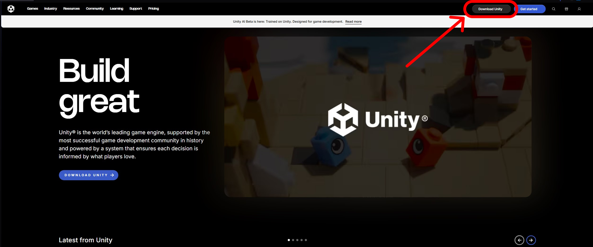
  > ⚠ If a login page shows up, please login or create an account first ⚠
- Download Unity Hub Installer
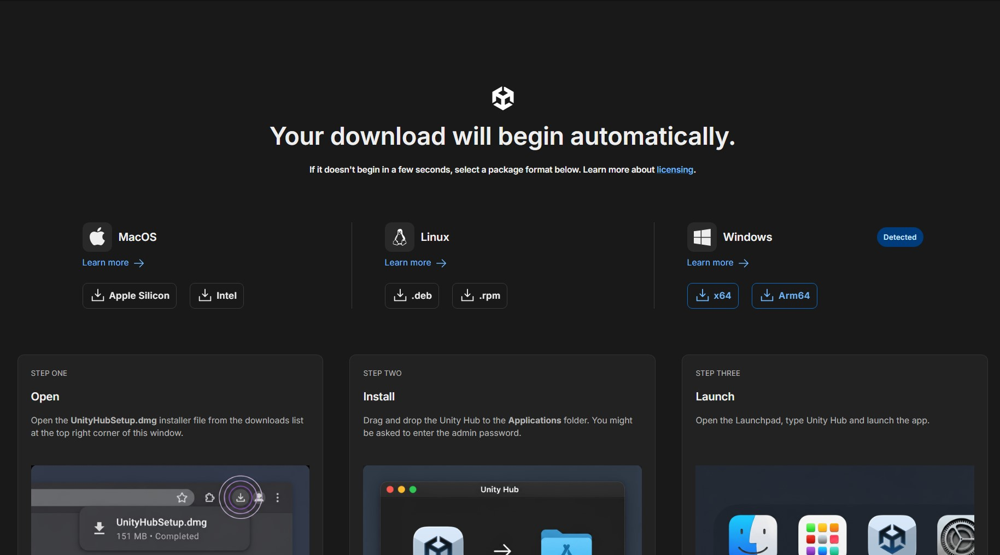
- After the download is complete, open the installer and follow it's steps until it has finished installing

## 2. Unity Hub & Unity Version Install
- After installing, open Unity Hub
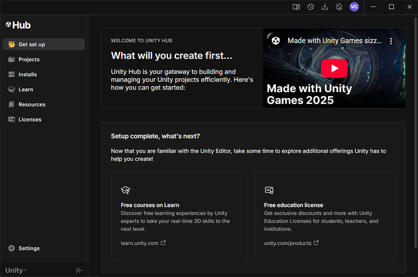
  > ⚠ If it's your first time opening it, it will prompt you to login or register first ⚠
- Now open the 'Installs' tab and here you can see every Unity Editor that's installed. If there's not any, please click the 'Install Editor' button.
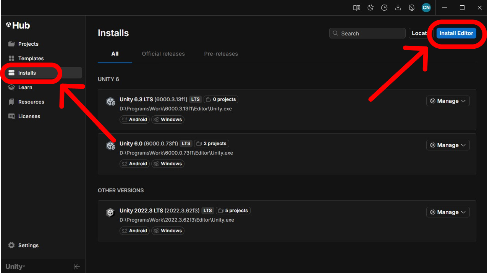
- In the 'Install Unity Editor' window, you can choose your desired editor. For the purposes of ClubDev, choose the version with '6000.0'.
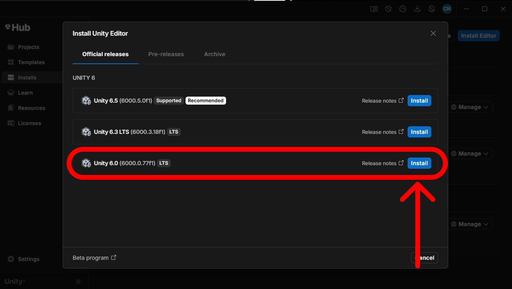
- You will then be prompted with a 'Add Module' window containing SDK and supports for building applications in different platforms. Click 'Continue' if you're done.
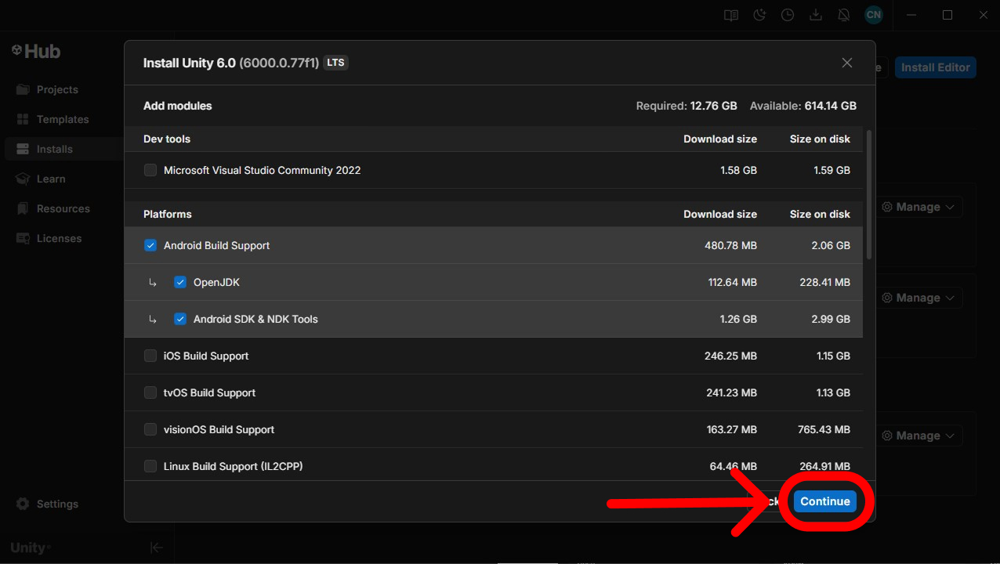
  > <strong>‼ Make sure to install a code editor (IDE) (like Visual Studio Code/Community) ‼</strong>
  There's an option to install Visual Studio Community when in the 'Dev tools' section.
- You can see the installation progress when clicking the download icon above
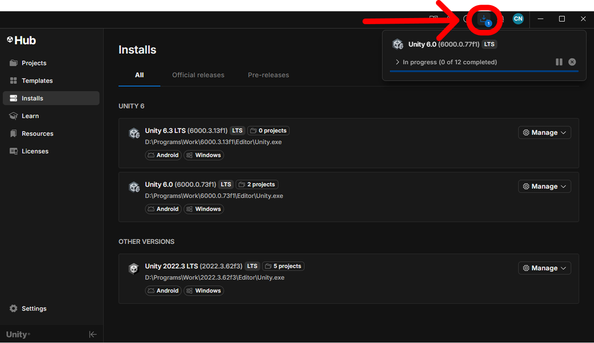
- If you need to install additional modules, you can access the 'Add Modules' window here.
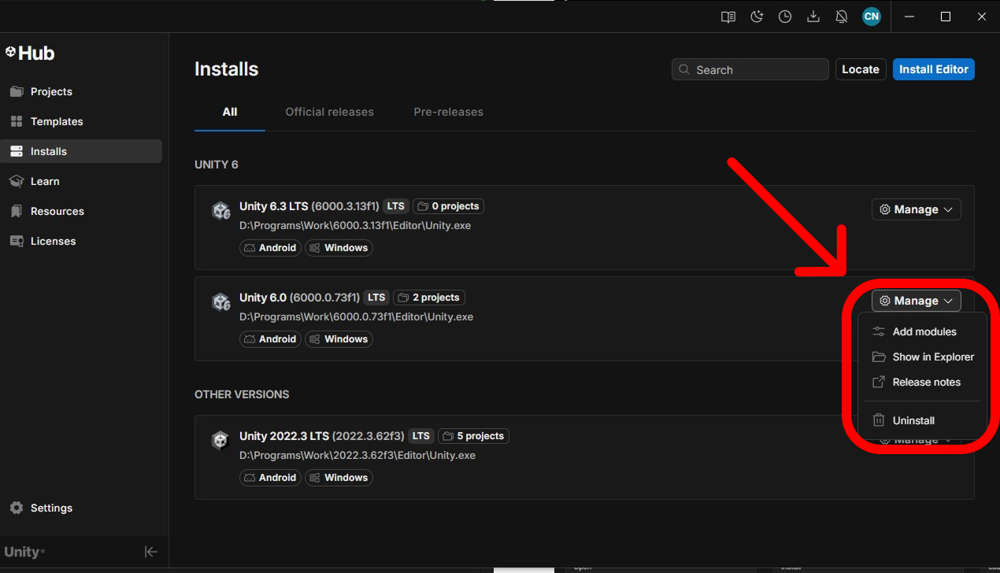
## 3. Licenses
> ⚠ To use Unity Hub and setup or access your projects, you need to have an active license. ⚠
- If you don't have an active license, go to the 'Licenses' tab and click the 'Add license' button on the top right.
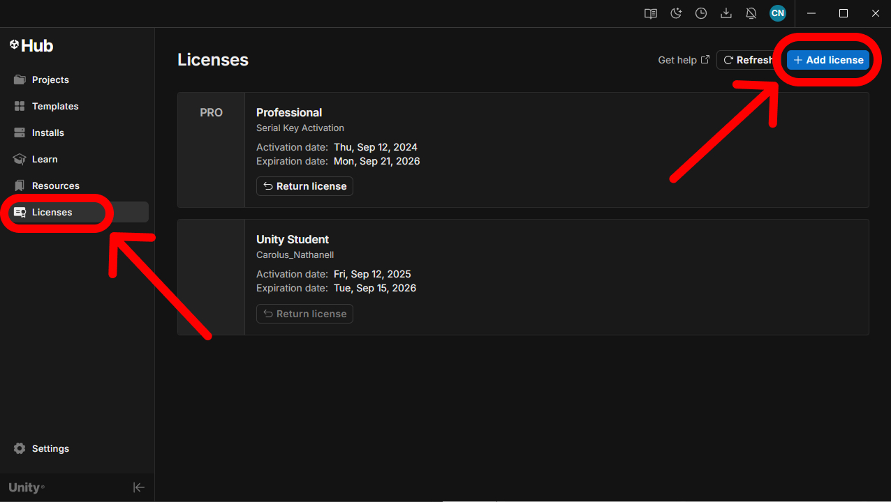
- Choose the 'free personal license' option.
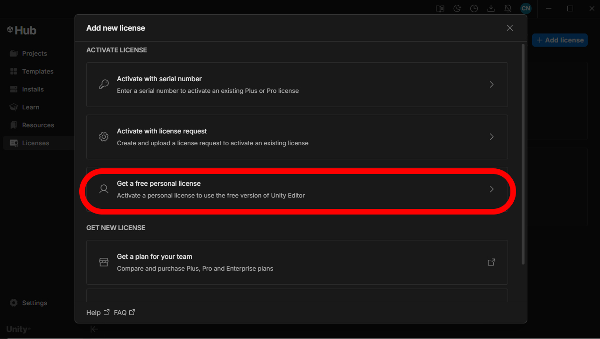
- You need to agree to the terms and condition of getting the license.
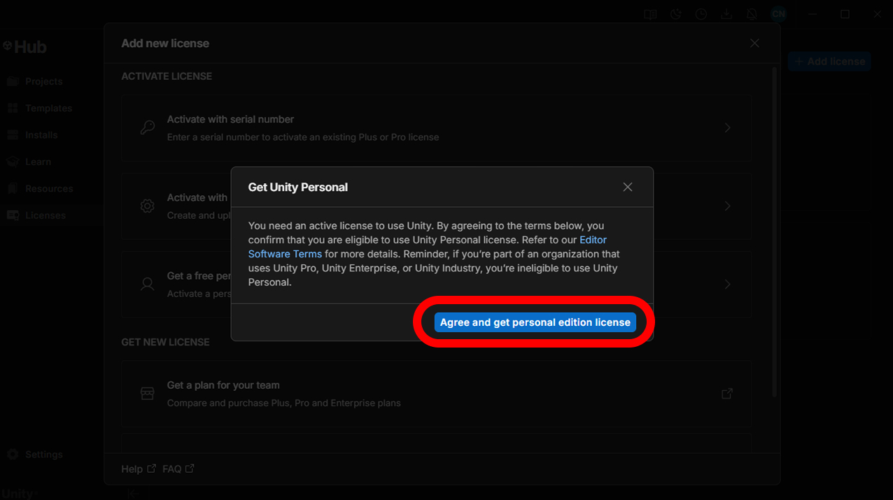
  >⚠ If you already have another Unity license active, it will be automatically returned. You can check for your licenses [here](https://id.unity.com/en/subscriptions) ⚠
## 4. Setup New Project
- Go to the 'Projects' tab and click on the 'New project' button on the top right.
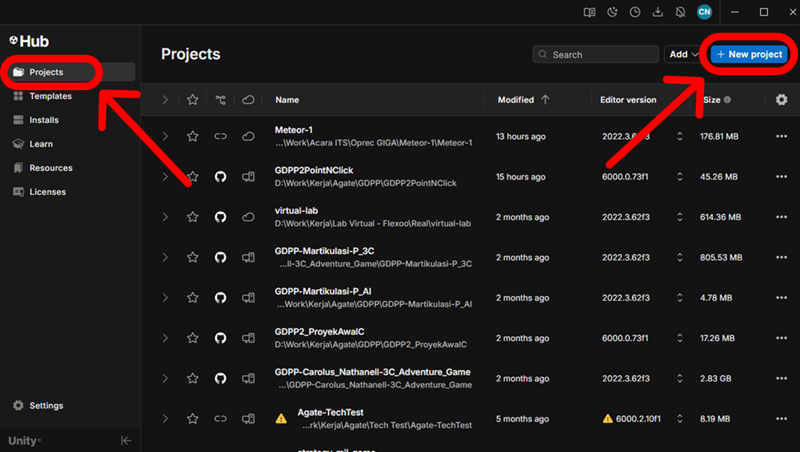
- In the 'New project' window there's 2 main sections, the editor configuration and the project details.
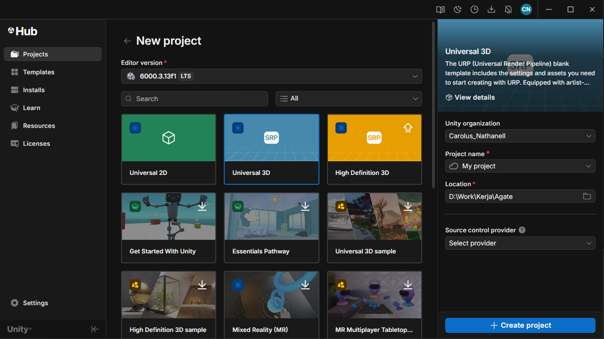
  - <strong>Editor Version:</strong> you can set your installed and desired Unity version here
  - <strong>below Editor Version:</strong> There's templates, samples, and tutorials. With the top 3 being a blank project (Universal 2D, Universal 3D, and High Definition 3D)
  - <strong>Project name:</strong> your project's name in Unity (application name can be changed)
  - <strong>Location:</strong> your project's file location
  - <strong>Source control provider:</strong> you can setup the project with a version controller
- After configuring the project, you can create it by clicking the "Create project" button on the bottom right. You can see the project setup progress on the new window.
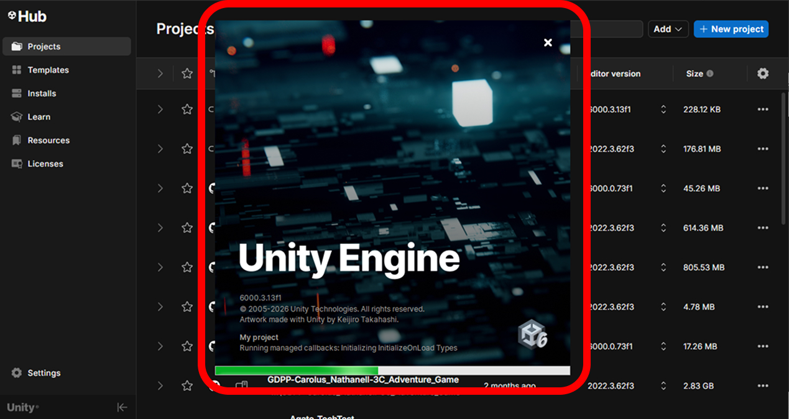
- ✨ Congrats, your new project is ready 🎉
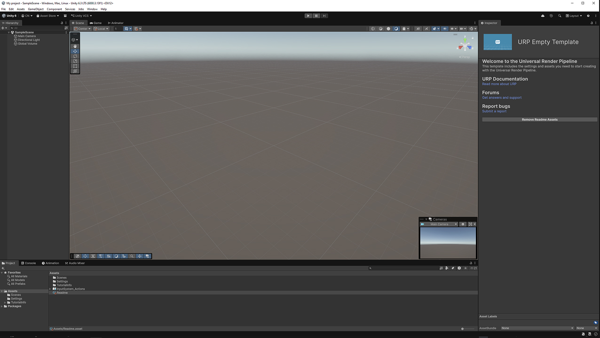
## i. Additional References
- IDE/code editor documentations for Unity
  - [Microsoft Visual Studio](https://learn.microsoft.com/en-us/visualstudio/gamedev/unity/get-started/visual-studio-tools-for-unity)
  - [Visual Studio Code](https://code.visualstudio.com/docs/other/unity)
  - [JetBrains Rider](https://www.jetbrains.com/help/rider/Unity.html)
- [Unity Hub Official Documentation](https://docs.unity.com/en-us/hub)