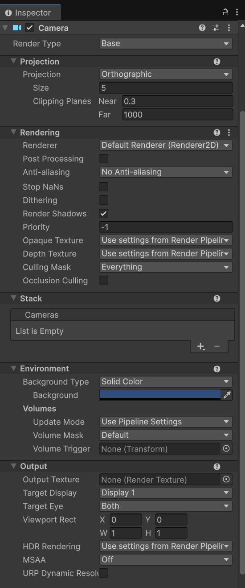

# Unity Features
An overview of Unity's core features you'll use in every 2D project. 

## 1. Scenes
A **Scene** is a container for your game world. Think of each scene as a level, menu, or screen.

- To create a scene: **right-click in the Project panel → Create → Scene**
- To open it: double-click it in the Project panel
- To save: **Ctrl + S**

> ⚠ Always save your scene before entering Play Mode or switching scenes ⚠

### Build Settings
For a scene to appear in your final game, it needs to be added to the **Build Settings**.
- Open via **File → Build Profiles**
- Drag your scenes from the Project panel into the Scenes list

## 2. Prefabs
A **Prefab** is a saved, reusable GameObject. Any changes made to the Prefab are automatically applied to every instance of it in your scenes.

- To create one: drag a GameObject from the Hierarchy into the Project panel
- To place an instance: drag the Prefab from the Project panel into the Hierarchy or Scene View
- To edit one: double-click it in the Project panel to enter **Prefab Mode**

## 3. Sprites
A **Sprite** is a 2D image used to visually represent a GameObject.

### Importing a Sprite
- Drag an image file (PNG, JPG) into the Project panel
- Select it and set the **Texture Type** to **Sprite (2D and UI)** in the Inspector, then click **Apply**

### Sprite Renderer
The **Sprite Renderer** component displays a sprite on a GameObject. Key settings:

| Setting | What it does |
|---|---|
| **Sprite** | The image to display |
| **Color** | Tints the sprite |
| **Sorting Layer** | Controls which layer this sprite renders on |
| **Order in Layer** | Controls draw order within the same sorting layer. Higher values render on top |

## 4. Physics 2D
Unity's 2D physics simulate realistic movement and collisions.

### Rigidbody 2D
Attach a **Rigidbody 2D** to a GameObject to make it react to physics. The **Body Type** setting controls how it behaves:

| Body Type | Behavior |
|---|---|
| **Dynamic** | Fully simulated, affected by gravity and forces |
| **Kinematic** | Moved by script only, not affected by gravity or other Rigidbodies |
| **Static** | Never moves, used for walls, floors, and other fixed geometry |

### Colliders 2D
A **Collider 2D** defines the physical boundary of a GameObject for collision detection. Choose the shape that best fits your sprite:

| Collider | Best used for |
|---|---|
| **Box Collider 2D** | Rectangular shapes |
| **Circle Collider 2D** | Round shapes |
| **Capsule Collider 2D** | Characters and tall shapes |
| **Polygon Collider 2D** | Irregular shapes (auto-traces the sprite) |

## 5. Camera
The **Camera** component renders what it sees to the screen. In a 2D project it uses **Orthographic** projection, with no perspective distortion.

Key settings in the Inspector:

| Setting | What it does |
|---|---|
| **Projection** | Set to Orthographic for 2D |
| **Size** | Controls how much of the scene is visible (zoom level) |
| **Background** | The color or skybox shown where nothing is rendered |

## 6. Layers & Tags
**Layers** and **Tags** are ways to label and organize GameObjects. They're especially useful once you start scripting.

- **Tag**: a single label on a GameObject (e.g. `Player`, `Enemy`, `Ground`)
- **Layer**: a group that GameObjects belong to, used to control physics collisions and camera rendering

To assign them: select a GameObject and use the **Tag** and **Layer** dropdowns at the top of the Inspector.

To create custom tags or layers: click **Add Tag...** from the dropdown, which opens the **Tags & Layers** settings.

## 7. Input System
The **Input System** is Unity's package for reading player input (keyboard, mouse, gamepad, touch).

- Install it via **Window → Package Management → Package Manager**, search for **Input System**, and click **Install**

> ⚠ Installing the Input System will prompt you to restart the editor. Save your work first. ⚠

## i. Additional References
- [Unity 6 Manual: Scenes](https://docs.unity3d.com/6000.0/Documentation/Manual/CreatingScenes.html)
- [Unity 6 Manual: Prefabs](https://docs.unity3d.com/6000.0/Documentation/Manual/Prefabs.html)
- [Unity 6 Manual: 2D Physics](https://docs.unity3d.com/6000.0/Documentation/Manual/Physics2DReference.html)
- [Unity 6 Manual: Input System](https://docs.unity3d.com/Packages/com.unity.inputsystem@1.11/manual/index.html)
