# Hands-On Unity 2D: "Sky Catcher"

## 1. Tentang Modul Ini

Modul ini ditulis untuk yang **baru-baru membuka Unity**. Modul ini menyediakan penjelasan dan langkah-langkah membuat satu game 2D yang bisa dimainkan, lengkap dengan sistem skor, audio, dan alur restart/game over.

Target waktu pengerjaan modul ini berdurasi 2 jam.

---

## 2. Game yang Akan Dibuat: "Sky Catcher"

Pemain akan mengendalikan pesawat kecil yang bergerak kiri-kanan di bagian bawah layar. Dari atas layar, bintang ⭐ dan meteor ☄️ berjatuhan secara acak.
- Tangkap **bintang** → skor bertambah.
- Tersentuh **meteor** → Game Over.
- Ada tombol **Restart** (load ulang scene) dan **Main Menu**.

> 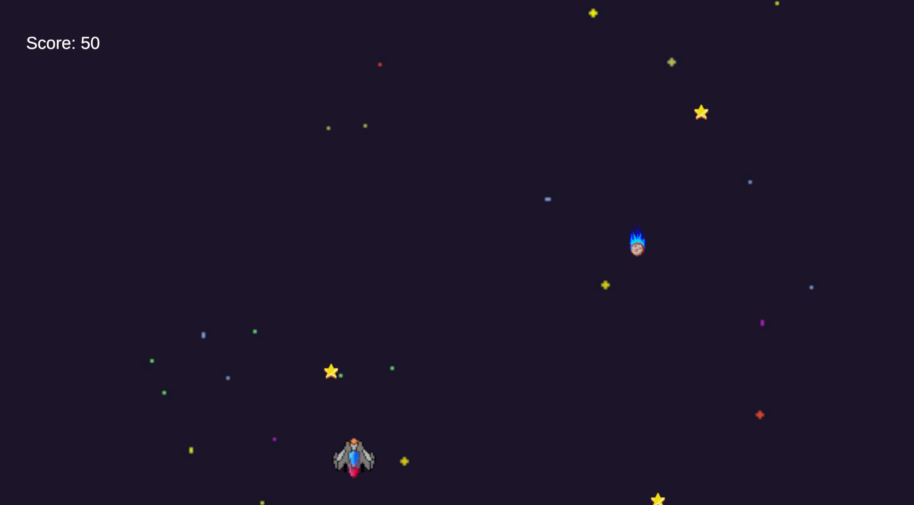

---

## 3. Materi yang Akan Dipelajari

Pada modul ini, kita akan mencoba implementasi:
1. Dasar **Unity Editor** (Scene, Game view, Hierarchy, Inspector, Project, Console).
2. **Rigidbody2D & Collider2D** untuk physics dan deteksi tabrakan (trigger).
3. **Sistem skor** menggunakan **TextMeshPro**.
4. Penambahan **audio** (sound effect) lewat AudioSource.
5. Konsep design pattern **Singleton** untuk mengakses script manager dari script lain.
6. Operasi **Scene** untuk restart gameplay, serta membuat alur **Game Over** dan **Main Menu** sederhana.

---

## 4. Sebelum Mulai: Checklist Persiapan

- Unity Hub sudah terinstall di laptop.
- Unity Editor versi LTS sudah terpasang (modul ini dibuat dengan Unity 6000.3).
- Sudah menerima folder asset (sprite pesawat, bintang, meteor, audio) yang dapat diakses melalui [link ini (GDrive)](https://drive.google.com/drive/folders/1SvXGDwa8RhXS-n9Zrq-0_e3NrJ88xdIW?usp=drive_link) atau [link ini (GitHub)](https://github.com/GIGA-IFITS/unity-beginner-materials/blob/main/4.%20Hands%20On/Assets.zip).
- Laptop dalam kondisi baterai penuh/tersambung charger.

---

## 5. Referensi Waktu

| No | Bagian | Durasi |
|----|--------|--------|
| 1 | Kenalan Unity Interface | ±10 menit |
| 2 | Setup Project & Import Asset | ±10 menit |
| 3 | Membuat Player: Rigidbody2D & Collider2D | ±15 menit |
| 4 | Membuat Item Jatuh: Star & Meteor + Spawner | ±15 menit |
| 5 | Memahami Collision & Trigger Detection | ±10 menit |
| 6 | Score System dengan TextMeshPro | ±10 menit |
| 7 | Audio: SFX | ±10 menit |
| 8 | Game Over, Restart Scene, + Bonus Main Menu | ±15 menit |
| 9 | Testing Akhir & Recap | ±5 menit |

---

## Bagian 1: Mengenal Unity Interface 

**Yang perlu dipahami:**
- Unity bekerja dengan konsep **GameObject** (objek di dalam game) yang punya kumpulan **Component** (kemampuan/fungsi) menempel padanya.
- 6 jendela utama yang akan sering dipakai:
  - **Scene view**: tempat menyusun objek secara visual.
  - **Game view**: preview hasil akhir yang dilihat pemain.
  - **Hierarchy**: daftar semua objek dalam scene yang aktif.
  - **Inspector**: detail & komponen dari objek yang sedang dipilih.
  - **Project window**: semua asset (script, sprite, prefab, audio) pada folder project.
  - **Console**: tempat muncul log, warning, dan error.

**Langkah:**
1. Buka Unity Hub → buat project baru → pilih template **2D** (boleh "2D Core" atau "2D URP", ikuti yang tersedia di Unity) → beri nama `SkyCatcher`.
2. Eksplorasi 5 jendela di atas, coba klik-klik dan pindahkan posisi tab dengan drag.
3. Buat GameObject kosong lewat `GameObject > Create Empty`, ganti namanya, amati bagaimana Inspector berubah mengikuti objek yang dipilih.

> 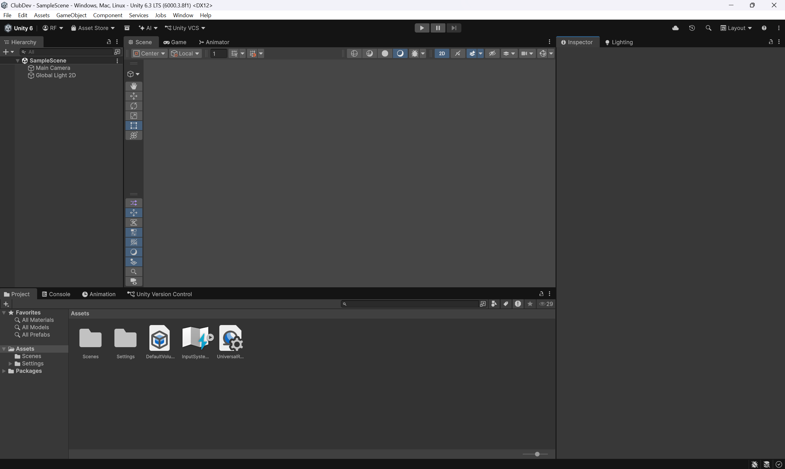

**✅ Cek:** Sudah bisa menunjukkan lokasi Hierarchy, Inspector, dan Project window.

---

## Bagian 2: Setup Project & Import Asset 

**Langkah:**
1. Di Project window, buat struktur folder rapi:
   ```
   Assets/
     Scripts/
     Sprites/
     Audio/
     Prefabs/
     Scenes/
   ```
   > 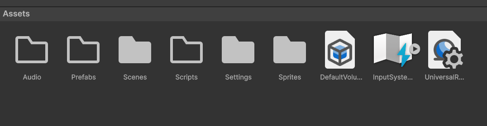
2. Import asset yang sudah diberikan (drag & drop sprite dan audio ke folder masing-masing) melalui [link ini (GDrive)](https://drive.google.com/drive/folders/1SvXGDwa8RhXS-n9Zrq-0_e3NrJ88xdIW?usp=drive_link) atau [link ini (GitHub)](https://github.com/GIGA-IFITS/unity-beginner-materials/blob/main/4.%20Hands%20On/Assets.zip).
3. Cek **Sprite Import Settings**: klik sprite → di Inspector pastikan `Texture Type = Sprite (2D and UI)` → klik **Apply**.
> 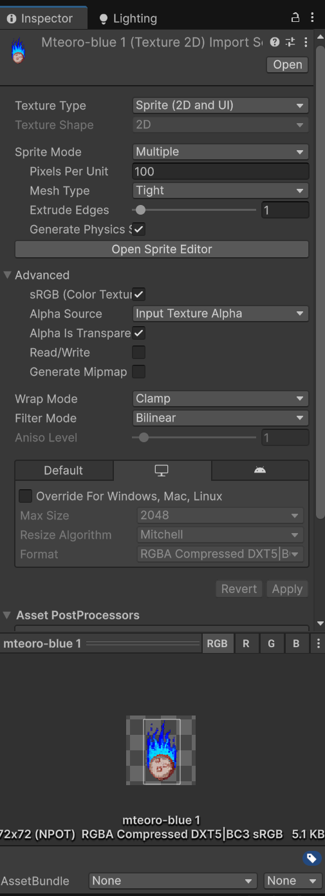

**✅ Cek:** Folder sudah rapi, sprite sudah ter-import dengan benar, dan Game view menampilkan area permainan dengan proporsi yang pas.

---

## Bagian 3: Membuat Player: Rigidbody2D & Collider2D 

**Konsep yang perlu dipahami:**
- **Rigidbody2D**: komponen yang membuat objek "dikenali" oleh sistem physics 2D Unity. Ada `Body Type`:
  - `Dynamic` → dipengaruhi gravitasi & gaya (akan dipakai untuk item jatuh nanti).
  - `Kinematic` → digerakkan lewat script, tidak terpengaruh gravitasi (cocok untuk player yang geraknya dapat dikontrol penuh).
- **Collider2D**: bentuk area tabrakan. Centang `Is Trigger` jika hanya ingin **mendeteksi** overlap tanpa efek fisik dorongan (pantulan dsb).

**Langkah:**
1. Drag sprite pesawat ke Scene, posisikan di bagian bawah layar (misal Y = -4).
2. Atur Scale hingga ukuran pesawat terlihat proporsional terhadap area permainan. Sebagai referensi, gunakan sekitar 3x jika menggunakan asset yang disediakan.
3. Beri nama `Player`, set **Tag** = `Player` (buat tag baru lewat Inspector → Tag → Add Tag).
> 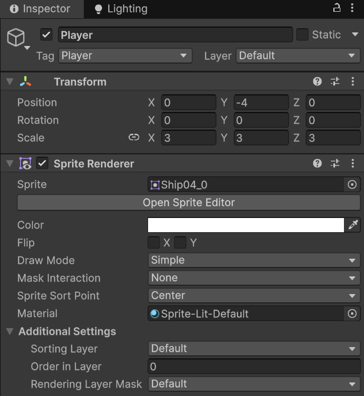
4. `Add Component` → **Rigidbody2D** → set `Body Type = Kinematic`.
5. Pada `RigidBody2D`, ubah `Interpolate` dari `None` menjadi `Interpolate` untuk mengurangi efek jitter saat bergerak.
5. `Add Component` → **Box Collider 2D** (atau Circle Collider 2D) → centang **Is Trigger**.
6. Buat script baru `Scripts/PlayerController.cs`:

    ```csharp
    using UnityEngine;
    using UnityEngine.InputSystem;

    public class PlayerController : MonoBehaviour
    {
        public float speed = 8f;

        private Rigidbody2D rb;
        private float halfWidth;
        private float moveInput;

        void Start()
        {
            rb = GetComponent<Rigidbody2D>();
            halfWidth = Camera.main.orthographicSize * Camera.main.aspect;
        }

        void Update()
        {
            moveInput = 0f;

            if (Keyboard.current != null)
            {
                if (Keyboard.current.aKey.isPressed || Keyboard.current.leftArrowKey.isPressed)
                    moveInput = -1f;

                if (Keyboard.current.dKey.isPressed || Keyboard.current.rightArrowKey.isPressed)
                    moveInput = 1f;
            }
        }

        void FixedUpdate()
        {
            Vector2 newPosition = rb.position + Vector2.right * moveInput * speed * Time.fixedDeltaTime;

            float clampedX = Mathf.Clamp(
                newPosition.x,
                -halfWidth,
                halfWidth
            );

            rb.MovePosition(new Vector2(clampedX, rb.position.y));
        }
    }
    ```
6. Drag script ke GameObject `Player`.
7. Tekan **Play**, coba gerakkan dengan tombol A/D atau panah kiri/kanan. Pesawat harus berhenti di tepi layar (tidak keluar).
> 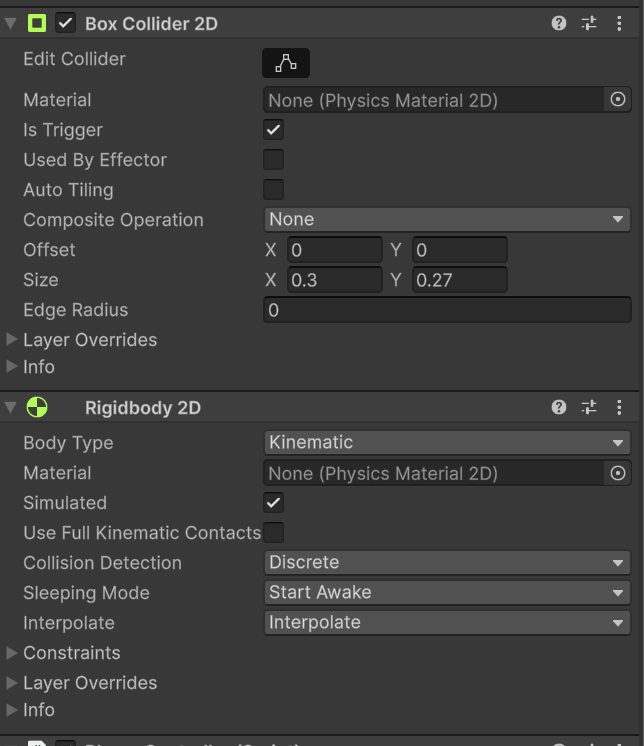

**✅ Cek:** Pesawat bisa bergerak kiri-kanan dan tidak keluar dari batas layar saat Play.

---

## Bagian 4: Membuat Item Jatuh: Star & Meteor + Spawner 

**Langkah membuat item:**
1. Drag sprite bintang ke Scene, beri nama `Star`.
2. `Add Component` → **Circle Collider 2D**, centang **Is Trigger**.
3. Ulangi langkah yang sama untuk sprite meteor, beri nama `Meteor`.
> 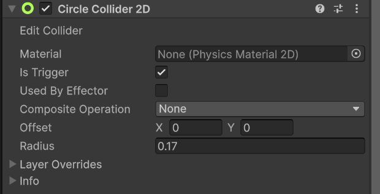

**Script penanda jenis objek** `Scripts/FallingObject.cs`:

  ```csharp
  using UnityEngine;

  public class FallingObject : MonoBehaviour
  {
      public enum ObjectType { Star, Meteor }
      public ObjectType type;

      public int scoreValue = 10;
      public float fallSpeed = 5f;

      void Update()
      {
          transform.position += Vector3.down * fallSpeed * Time.deltaTime;

          if (transform.position.y < -6f)
          {
              Destroy(gameObject);
          }
      }

      void OnTriggerEnter2D(Collider2D other)
      {
          if (!other.CompareTag("Player")) return;

          if (type == ObjectType.Star)
          {
              if (ScoreManager.Instance != null)
              {
                  ScoreManager.Instance.AddScore(scoreValue);
              }
              if (AudioManager.Instance != null)
              {
                  AudioManager.Instance.PlaySFX(AudioManager.Instance.catchClip);
              }
          }
          else
          {
              if (AudioManager.Instance != null)
              {
                  AudioManager.Instance.PlaySFX(AudioManager.Instance.explosionClip);
              }
              if (GameManager.Instance != null)
              {
                  GameManager.Instance.GameOver();
              }
          }
          
          Destroy(gameObject);
      }
  }
  ```

  > ⚠️ **Wajar jika muncul error di Console** setelah menulis script ini. Script memanggil `ScoreManager`, `AudioManager`, `GameManager` yang **belum dibuat**. Error ini akan hilang otomatis setelah menyelesaikan Bagian 6-8. Ini bagian normal dari proses belajar membaca error message. Untuk sekarang, bisa dihapus atau dikomen baris 25-46 yang menyebabkan error tersebut, kita akan menambahkan kembali nanti setelah bagian terkait selesai.

5. Attach script ke `Star` (set `type = Star`) dan ke `Meteor` (set `type = Meteor`).
6. Drag kedua GameObject ke folder `Prefabs` untuk menjadikannya **Prefab**, lalu hapus instance-nya dari Scene.
> 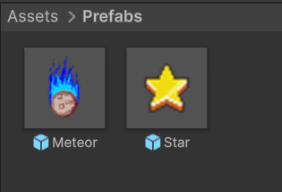

**Langkah membuat Spawner:**
1. `GameObject > Create Empty`, beri nama `Spawner`, posisikan di atas layar (Y = 6).
2. Buat script `Scripts/Spawner.cs`:

    ```csharp
    using UnityEngine;

    public class Spawner : MonoBehaviour
    {
        public GameObject starPrefab;
        public GameObject meteorPrefab;
        public float spawnInterval = 1f;
        public float spawnRangeX = 7f;

        private float timer;

        void Update()
        {
            timer += Time.deltaTime;
            if (timer >= spawnInterval)
            {
                timer = 0f;
                SpawnObject();
            }
        }

        void SpawnObject()
        {
            GameObject prefabToSpawn = Random.value > 0.3f ? starPrefab : meteorPrefab;
            float randomX = Random.Range(-spawnRangeX, spawnRangeX);
            Vector2 spawnPos = new Vector2(randomX, transform.position.y);
            Instantiate(prefabToSpawn, spawnPos, Quaternion.identity);
        }
    }
    ```

3. Drag script ke `Spawner`, isi field `Star Prefab` dan `Meteor Prefab` di Inspector dengan prefab dari folder `Prefabs`.
> 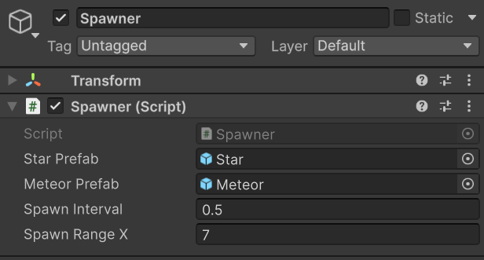

**✅ Cek:** Saat Play, bintang dan meteor berjatuhan otomatis dari atas secara acak.

> 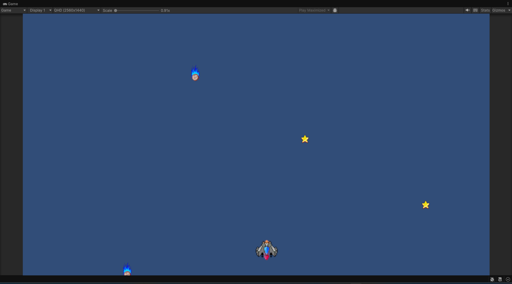
---

## Bagian 5: Memahami Collision & Trigger Detection 

Bagian ini memperkuat konsep yang baru dipakai di Bagian 4.

**Yang perlu dipahami:**
- `OnTriggerEnter2D` dipanggil saat dua collider **ber-trigger** (minimal salah satu `Is Trigger` dicentang) saling bersentuhan.
- `OnCollisionEnter2D` dipakai jika menginginkan efek fisik nyata (pantulan, dorongan), **tidak dipakai** di game ini karena hanya dibutuhkan deteksi, bukan tabrakan fisik.
- Syarat penting: Untuk interaksi `OnTriggerEnter2D` pada kasus kita, pastikan salah satu GameObject yang terlibat memiliki `Rigidbody2D`. kalau tidak, event tidak akan terpanggil sama sekali. Ini sering jadi sumber bug bagi pemula.
- `CompareTag("Player")` dipakai supaya hanya pemain yang memicu efek skor/game over (bukan sesama item jatuh yang saling bersentuhan).

**Aktivitas kecil untuk dicoba:**
Sengaja hapus centang `Is Trigger` di collider `Player`, lalu tekan Play dan amati bedanya. Setelah selesai mengamati, kembalikan centang seperti semula.
**Amati**:
- Apakah `OnTriggerEnter2D` masih terpanggil?
- Apa perbedaan antara Trigger dan Collision?

**✅ Cek:** Aku bisa menjelaskan dengan kata sendiri kapan `OnTriggerEnter2D` terpanggil.


---

## Bagian 6: Score System dengan TextMeshPro 

**Langkah:**
1. Klik kanan di Hierarchy → `UI > Canvas` (ini otomatis membuat `EventSystem` juga).
2. Pada Canvas, atur **Canvas Scaler** → `UI Scale Mode = Scale With Screen Size`, `Reference Resolution` sesuaikan dengan target platform (misal 1920x1080).
> 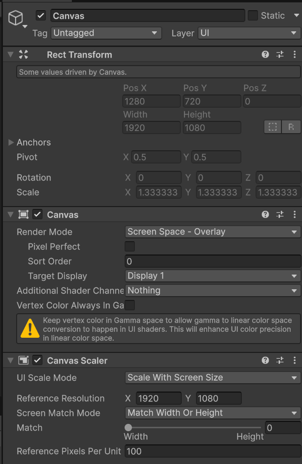
3. Klik kanan pada Canvas → `UI > Text - TextMeshPro`, beri nama `ScoreText`, posisikan di pojok atas.
4. Jika muncul prompt, import TMP Essentials: `Window > TextMeshPro > Import TMP Essential Resources`.
5. Buat script `Scripts/ScoreManager.cs`:

    ```csharp
    using UnityEngine;
    using TMPro;

    public class ScoreManager : MonoBehaviour
    {
        public static ScoreManager Instance;
        public TextMeshProUGUI scoreText;

        private int currentScore = 0;

        void Awake()
        {
            Instance = this;
        }

        void Start()
        {
            UpdateScoreText();
        }

        public void AddScore(int amount)
        {
            currentScore += amount;
            UpdateScoreText();
        }

        public int GetScore()
        {
            return currentScore;
        }

        void UpdateScoreText()
        {
            scoreText.text = "Score: " + currentScore;
        }
    }
    ```

6. Buat GameObject kosong `GameManagerObject`, attach script ini, drag `ScoreText` ke field `Score Text` di Inspector.
> 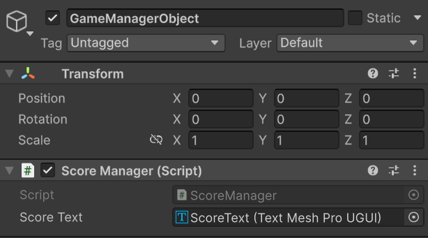   
7. Modifikasi kode berikut pada `FallingObject.cs` di bagian `OnTriggerEnter2D` untuk menambah skor saat bintang tertangkap (sudah ada di bagian sebelumnya).
    ```csharp
        void OnTriggerEnter2D(Collider2D other)
        {
            if (!other.CompareTag("Player")) return;

            if (type == ObjectType.Star)
            {
                if (ScoreManager.Instance != null)
                {
                    ScoreManager.Instance.AddScore(scoreValue);
                }
            }

            Destroy(gameObject);
        }
    ```

**✅ Cek:** Saat Play, menangkap bintang membuat angka skor di layar bertambah.

---

## Bagian 7: Audio

**Yang perlu dipahami:**
- **AudioSource** adalah komponen yang "memutar" suara.
- `PlayOneShot()` cocok untuk sound effect pendek yang bisa tumpang tindih (misal beberapa kali tangkap bintang secara cepat).

**Langkah:**
1. Buat GameObject kosong `AudioSourceObject`, tambahkan sebuah **AudioSource**:
   - `SFX Source` (untuk suara tangkap & ledakan)
    > 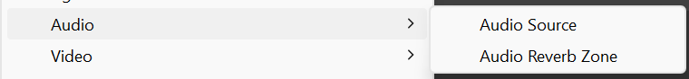
2. Buat script `Scripts/AudioManager.cs`:

    ```csharp
    using UnityEngine;

    public class AudioManager : MonoBehaviour
    {
        public static AudioManager Instance;
        public AudioSource sfxSource;
        public AudioClip catchClip;
        public AudioClip explosionClip;

        void Awake()
        {
            Instance = this;
        }

        public void PlaySFX(AudioClip clip)
        {
            sfxSource.PlayOneShot(clip);
        }
    }
    ```

3. Drag script `AudioManager` ke `GameManagerObject`, isi `Sfx Source` dengan AudioSource pada `AudioSourceObject`, isi `Catch Clip` dan `Explosion Clip` dengan file audio yang sudah ter-import.
> 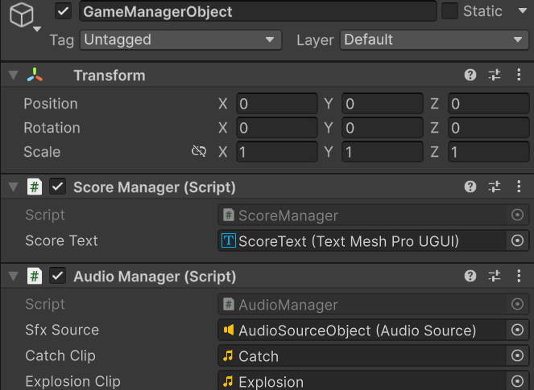
4. Modifikasi `FallingObject.cs` agar memanggil `AudioManager.Instance.PlaySFX()` saat bintang tertangkap atau meteor meledak (sudah ada di script sebelumnya).
    ```csharp
    void OnTriggerEnter2D(Collider2D other)
    {
        if (!other.CompareTag("Player")) return;

        if (type == ObjectType.Star)
        {
            if (ScoreManager.Instance != null)
            {
                ScoreManager.Instance.AddScore(scoreValue);
            }
            if (AudioManager.Instance != null)
            {
                AudioManager.Instance.PlaySFX(AudioManager.Instance.catchClip);
            }
        }
        else
        {
            if (AudioManager.Instance != null)
            {
                AudioManager.Instance.PlaySFX(AudioManager.Instance.explosionClip);
            }
        }
        
        Destroy(gameObject);
    }
    ```

**✅ Cek:** Suara "tangkap" terdengar tiap kali bintang tertangkap.

---

## Bagian 8: Game Over, Restart Scene, + Bonus Main Menu 

### Bagian 8A: Game Over Panel & Restart

1. Di Canvas, klik kanan → `UI > Panel`, beri nama `GameOverPanel`. Non-aktifkan (uncheck) GameObject ini di Inspector supaya tersembunyi di awal.
2. Di dalam panel, tambahkan:
   - `TextMeshPro - Text` bertuliskan "Game Over", beri nama `GameOverText`. Atur posisinya di x = 0, y = 200, z = 0. Atur width menjadi 400, height 100, font size 72, alignment center.
   > 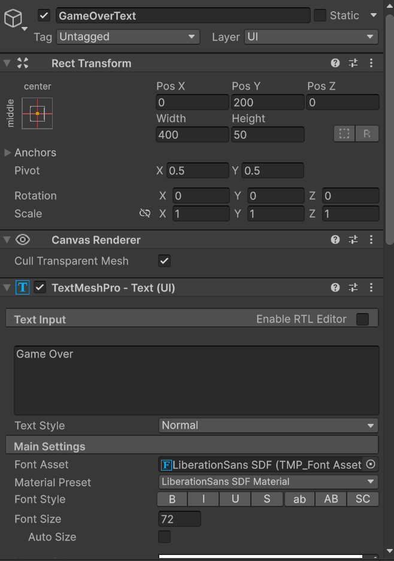
   - `TextMeshPro - Text` untuk skor akhir, beri nama `FinalScoreText`. Atur posisinya di x = 0, y = -100, z = 0. Atur width menjadi 400, height 100, font size 48, alignment center.
   - `Button - TextMeshPro` bertuliskan "Restart", beri nama `RestartButton`. Atur posisinya di x = 0, y = -300, z = 0. Atur width menjadi 200, height 60.
   > 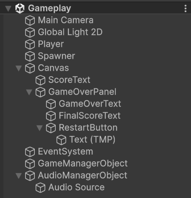
  
4. Buat script `Scripts/GameManager.cs`:
    ```csharp
    using UnityEngine;
    using UnityEngine.SceneManagement;
    using TMPro;

    public class GameManager : MonoBehaviour
    {
        public static GameManager Instance;
        public GameObject gameOverPanel;
        public TextMeshProUGUI finalScoreText;

        void Awake()
        {
            Instance = this;
        }

        void Start()
        {
            gameOverPanel.SetActive(false);
        }

        public void GameOver()
        {
            gameOverPanel.SetActive(true);
            finalScoreText.text = "Final Score: " + ScoreManager.Instance.GetScore();
            Time.timeScale = 0f; // pause seluruh gameplay
        }

        public void RestartGame()
        {
            Time.timeScale = 1f;
            SceneManager.LoadScene(SceneManager.GetActiveScene().name);
        }
    }
    ```

5. Drag script ini ke `GameManagerObject`, isi field `Game Over Panel` dan `Final Score Text`.

> 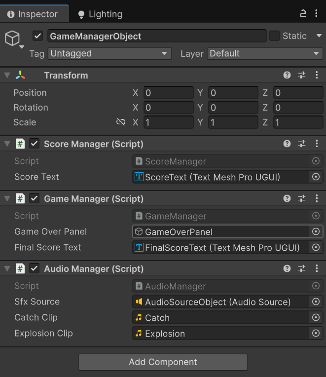
7. Pilih tombol `RestartButton` → di Inspector bagian `On Click ()` → klik `+` → drag `GameManagerObject` → pilih fungsi `GameManager > RestartGame()`.

> 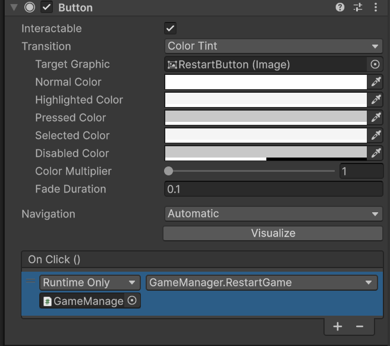
8. Pastikan Scene sudah tersimpan (`Ctrl+S`) dengan nama, misal `Gameplay`, lalu masuk ke `File > Build Profiles` pada tab `Scene List`, klik `Add Open Scenes` agar scene dikenali sistem.

> 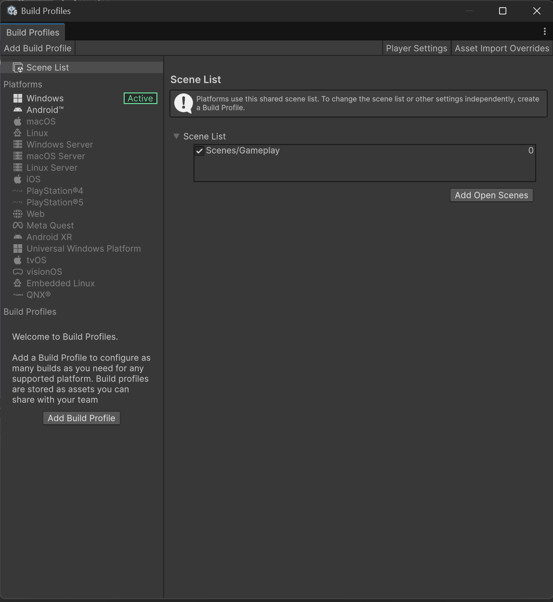
9. Modifikasi `FallingObject.cs` agar memanggil `GameManager.Instance.GameOver()` saat meteor menyentuh player (sudah ada di script sebelumnya).
    ```csharp
    void OnTriggerEnter2D(Collider2D other)
    {
        if (!other.CompareTag("Player")) return;

        if (type == ObjectType.Star)
        {
            if (ScoreManager.Instance != null)
            {
                ScoreManager.Instance.AddScore(scoreValue);
            }
            if (AudioManager.Instance != null)
            {
                AudioManager.Instance.PlaySFX(AudioManager.Instance.catchClip);
            }
        }
        else
        {
            if (AudioManager.Instance != null)
            {
                AudioManager.Instance.PlaySFX(AudioManager.Instance.explosionClip);
            }
            if (GameManager.Instance != null)
            {
                GameManager.Instance.GameOver();
            }
        }
        
        Destroy(gameObject);
    }
    ```
> ⚠️ **Konsep penting:** pemanggilan `ScoreManager.Instance`, `AudioManager.Instance` dan `GameManager.Instance` di script lain adalah contoh implementasi salah satu design pattern, yaitu **Singleton Pattern**. Ini memungkinkan script lain mengakses fungsi manager tanpa harus drag & drop referensi di Inspector.

### Bagian 8B: Main Menu (Bonus)

1. Buat Scene baru: `File > New Scene`, simpan dengan nama `MainMenu`.
> 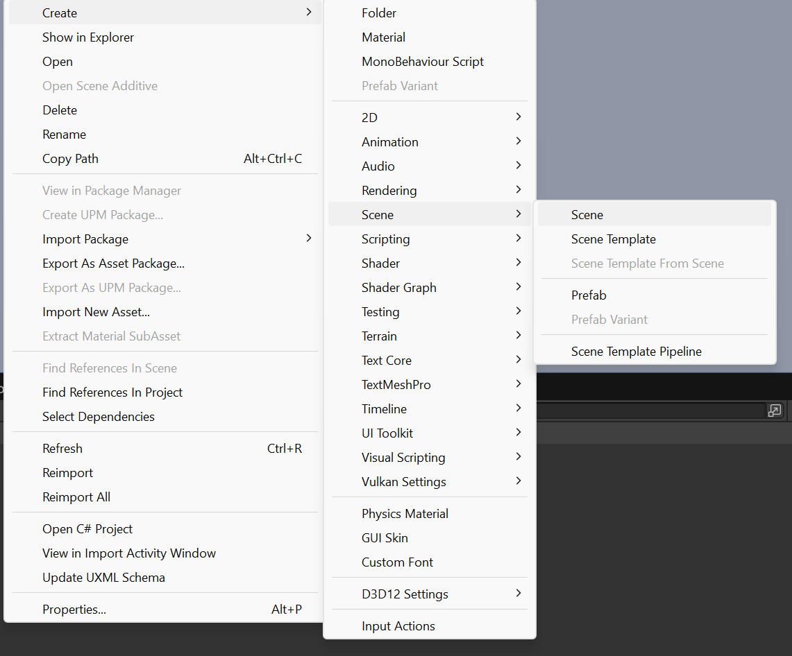
2. Membuat UI Main Menu:
    - Di Hierarchy, klik kanan → `UI > Canvas`, rename menjadi `MainMenuCanvas`.
   - Pada Canvas, buka **Canvas Scaler** dan pilih `UI Scale Mode = Scale With Screen Size`.
   - Atur `Reference Resolution`, misalnya `1920 x 1080`.
   - Klik kanan `MainMenuCanvas` → `UI > Image`, rename menjadi `Background`.
   - Masukkan sprite background ke `Source Image`. Jika background menggunakan pola yang ingin diulang, ubah `Image Type` menjadi `Tiled`.
   - Klik kanan `MainMenuCanvas` → `UI > Text - TextMeshPro`, rename menjadi `TitleText`, lalu isi dengan judul **Sky Catcher**.
   - Atur ukuran, posisi, dan alignment judul agar berada di area atas/tengah layar.
   - Klik kanan `MainMenuCanvas` → `UI > Button - TextMeshPro`, rename menjadi `PlayButton`.
   - Buka child Text/TMP di dalam button dan ubah tulisannya menjadi **Play**.
   - Posisikan tombol di tengah layar.
3. Buat script `Scripts/MainMenuManager.cs`, attach ke GameObject kosong dan namai `MainMenuManager`:

    ```csharp
    using UnityEngine;
    using UnityEngine.SceneManagement;

    public class MainMenuManager : MonoBehaviour
    {
        public void PlayGame()
        {
            SceneManager.LoadScene("Gameplay");
        }
    }
    ```

4. Hubungkan tombol "Play" ke fungsi `PlayGame()` lewat `On Click ()`.
5. Tambahkan `GoToMainMenu()` di `GameManager.cs` sebagai opsi tambahan:

    ```csharp
        public void GoToMainMenu()
        {
            Time.timeScale = 1f;
            SceneManager.LoadScene("MainMenu");
        }
    ```

6. Tambahkan tombol Main Menu pada Game Over Panel secara lengkap:
   - Kembali ke Scene `Gameplay`.
   - Di Hierarchy, buka `GameOverCanvas > GameOverPanel`.
   - Klik kanan `GameOverPanel` → `UI > Button - TextMeshPro`.
   - Rename menjadi `MainMenuButton`.
   - Buka child Text/TMP di dalam button dan ubah tulisannya menjadi **Main Menu**.
   - Atur posisi tombol di bawah tombol Restart, misalnya x = 0, y = -380, z = 0.
   - Atur ukuran tombol sekitar width = 200 dan height = 60.
   - Pilih `MainMenuButton`.
   - Di Inspector, cari **Button > On Click ()**.
   - Klik `+`.
   - Drag GameObject `GameManager` dari Hierarchy ke slot object.
   - Klik dropdown fungsi → pilih `GameManager > GoToMainMenu()`.
   - Tekan Play, sengaja tangkap meteor, lalu saat Game Over klik **Main Menu**. Pastikan game kembali ke scene `MainMenu`.
    > 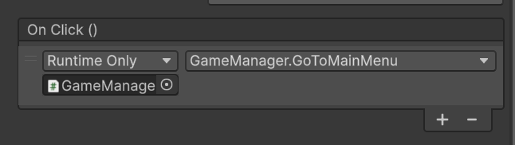
7. Buka `File > Build Settings`, urutkan scene: **index 0 = MainMenu**, **index 1 = Gameplay** (drag untuk mengatur urutan).
> 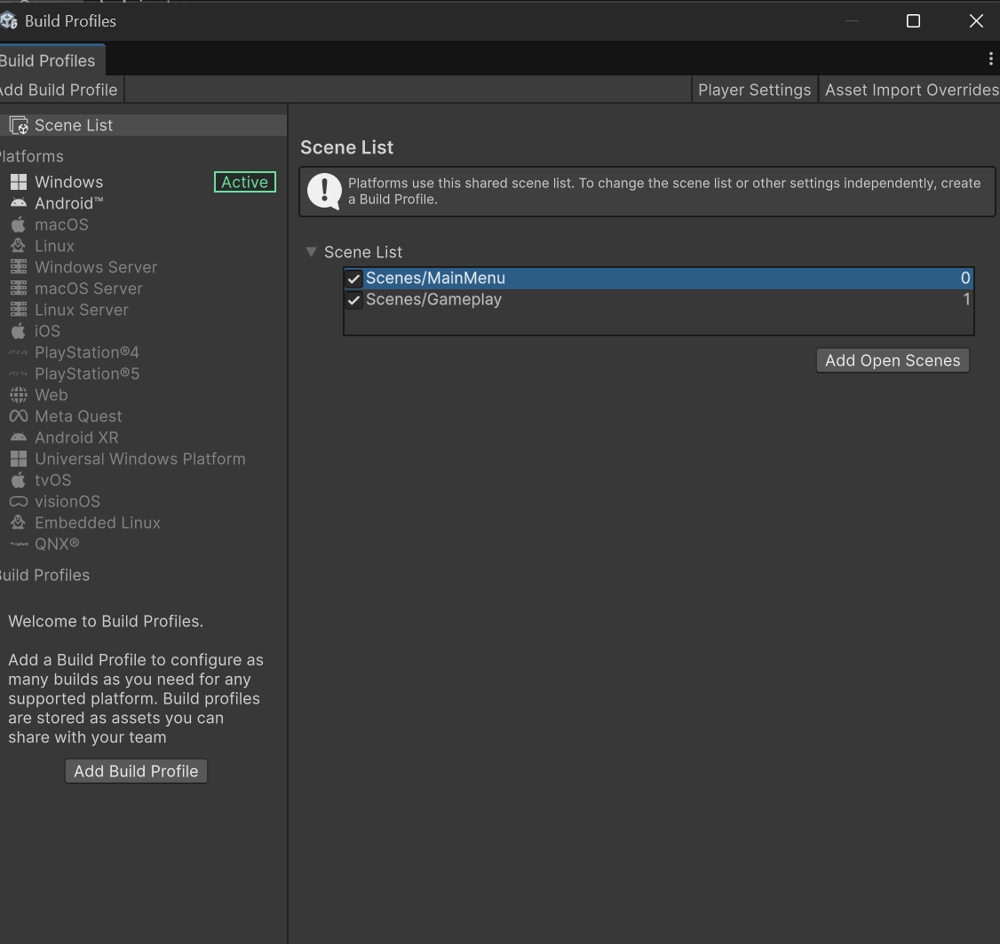

**✅ Cek (bonus):** Dari Main Menu bisa masuk ke Gameplay, dan dari Game Over bisa kembali ke Main Menu.

> 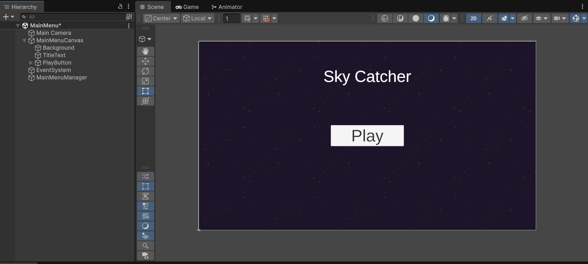
---

## Bagian 9: Testing Akhir & Recap 

**Langkah:**
- Playtest end-to-end: Main Menu → Play → tangkap bintang → kena meteor → Game Over → Restart / kembali ke Main Menu.
- Pastikan tidak ada error merah tersisa di Console.

**Recap 4 konsep inti yang sudah dipraktikkan hari ini:**
1. Rigidbody2D & Collider2D (physics + trigger detection)
2. Score system dengan TextMeshPro
3. Audio (SFX dengan PlayOneShot)
4. Singleton Pattern + GameManager untuk mengatur alur game
5. SceneManager.LoadScene untuk restart & navigasi menu

> 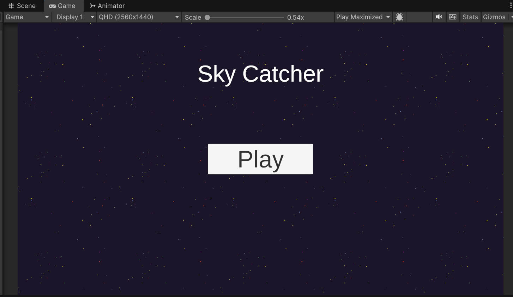
> 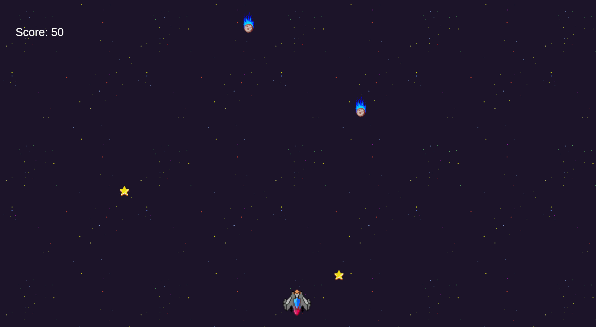
> 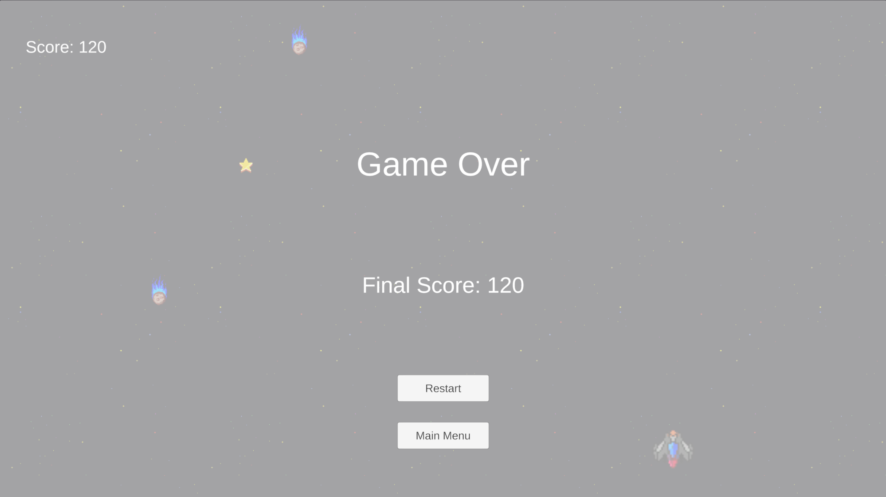

---

## 6. Troubleshooting Umum

Jika ditemui masalah berikut, coba solusi ini sebelum bertanya ke pemateri:

| Masalah | Kemungkinan Penyebab | Solusi |
|---|---|---|
| Script error "nama komponen tidak dikenal" | Ada typo di nama class atau nama file script tidak sama dengan nama class | Pastikan nama file `.cs` persis sama dengan nama class di dalamnya |
| `OnTriggerEnter2D` tidak pernah terpanggil | Tidak ada Rigidbody2D di salah satu objek, atau `Is Trigger` belum dicentang | Cek ulang kedua objek yang bertabrakan, minimal satu punya Rigidbody2D |
| Item jatuh menembus layar tanpa terhapus | Kondisi `transform.position.y < -6f` belum sesuai ukuran layar kamu | Sesuaikan angka batas dengan `Orthographic Size` kamera kamu |
| Skor tidak berubah saat menangkap bintang | Field `Score Text` di ScoreManager belum di-assign di Inspector | Cek kembali Inspector, drag ulang `ScoreText` ke field yang benar |
| Audio tidak berbunyi | AudioClip belum di-assign, atau volume AudioSource di 0 | Cek field clip dan volume di Inspector AudioSource |
| Tombol tidak berfungsi saat diklik | `On Click ()` di Button belum dihubungkan ke fungsi | Cek kembali langkah menghubungkan tombol ke method di Inspector |

---

## 7. Tantangan Lanjutan (Take-Home, Opsional)

Untuk kamu yang ingin berlatih lebih jauh di luar sesi ini:
- Tambahkan **sistem nyawa (lives)**: 3 kali kena meteor baru Game Over, bukan langsung sekali.
- Tambahkan backround music (BGM) yang loop terus menerus selama gameplay.
- Tambahkan background sprite di belakang.
- Tambahkan **kecepatan spawn meningkat** seiring waktu bermain (semakin lama semakin sulit).

---

