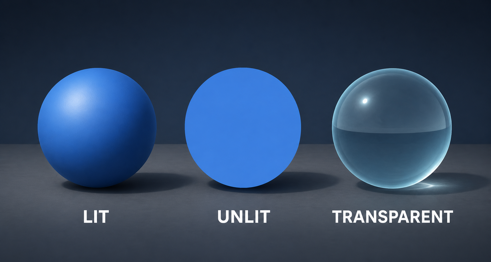

# Practice: Material Comparison Scene

Build a small scene that makes the difference between lit, unlit, opaque, and transparent materials easy to observe.

Use this comparison as a visual target. Your result does not need to match its colors or camera angle exactly.



## Learning Goals

By the end of this exercise, you should be able to:

- Create and assign materials.
- Explain the visible difference between Lit and Unlit shaders.
- Configure a transparent material.
- Adjust a light and camera deliberately.
- Identify a few graphics settings that affect performance.

## 1. Prepare the Scene

1. Create a new scene named `GraphicsPractice`.
2. Add a Plane and name it `Floor`.
3. Add three Spheres and name them `LitSphere`, `UnlitSphere`, and `GlassSphere`.
4. Place the spheres side by side above the floor.
5. Keep or add one Directional Light.

A simple hierarchy is enough:

```text
GraphicsPractice
|-- Main Camera
|-- Directional Light
|-- Floor
|-- LitSphere
|-- UnlitSphere
`-- GlassSphere
```

## 2. Create the Materials

Create a folder named `Materials`, then create these three materials inside it:

| Material | Shader | Suggested setup |
|---|---|---|
| `M_Lit` | Universal Render Pipeline/Lit | Choose a base color and leave Surface Type as Opaque |
| `M_Unlit` | Universal Render Pipeline/Unlit | Use the same base color as `M_Lit` |
| `M_Glass` | Universal Render Pipeline/Lit | Set Surface Type to Transparent and lower the base color alpha |

Assign each material to its matching sphere. The Lit and Unlit spheres should use the same color so their response to lighting is the main visible difference.

## 3. Test the Lighting

Enter Play Mode or work directly in the Scene View with lighting enabled.

1. Rotate the Directional Light.
2. Set its Intensity to a low value, then a higher value.
3. Temporarily disable the light.
4. Observe each sphere after every change.

Record your observations:

| Question | Observation |
|---|---|
| Which sphere changes most when the light rotates? | |
| Which sphere keeps a nearly constant color? | |
| What can be seen through the transparent sphere? | |

## 4. Configure the Camera

Position the camera so all three spheres remain visible in the Game View.

- Test both **Perspective** and **Orthographic** projection.
- Reduce the Far Clipping Plane while keeping every object visible.
- Put one sphere on a new layer, then use the Culling Mask to hide and show it.

Restore the camera to the projection that presents the comparison most clearly.

## 5. Inspect Rendering Cost

Open the **Stats** overlay in the Game View and note the values shown for the scene. Then duplicate the transparent sphere several times and compare the result.

Delete the duplicates after the observation. The goal is to connect a visual choice with measurable rendering work, not to optimize a tiny practice scene.

## Completion Checklist

- [ ] The scene contains three clearly labeled spheres.
- [ ] Lit and Unlit materials use the same base color.
- [ ] The transparent material reveals objects behind it.
- [ ] Rotating the light changes the Lit sphere more than the Unlit sphere.
- [ ] The camera's Far Clipping Plane is no larger than the scene needs.
- [ ] The Culling Mask successfully hides one selected layer.
- [ ] The effect of duplicating transparent objects was observed in the Stats overlay.

## Challenge

Create a fourth material using a normal map. Apply it to another sphere, rotate the light, and explain why the surface can appear detailed even though the sphere's mesh has not changed.
