# Graphics Polishing: Sky Catcher

Modul lanjutan dari [Hands-On](../4.%20Hands%20On/README.md). Kita akan membangun suasana ruang angkasa, lalu memberikan feedback pada star, meteor, dan player.

## Persiapan

1. Pastikan modul Hands-On sudah berfungsi: Play, bergerak, menangkap star, terkena meteor, Restart, dan Main Menu. [link modul Hands-On](https://github.com/devreonid/ProjectClubdev)
2. Simpan scene dan buat checkpoint Git atau salinan project. Jangan menggunakan folder `Library` sebagai backup source.
3. Buka `Assets/Scenes/Gameplay.unity`. Pastikan render pipeline memakai `Assets/Settings/UniversalRP.asset` dan Renderer 2D.
4. Asset baseline: `Background.png`, `Star.png`, `Meteor.png`, `Ship.gif`, prefab `Star_0`, prefab `Meteor_0`, serta tujuh script gameplay.
5. Buat folder `Assets/GraphicsPolish/{Textures,Materials,Prefabs}` dan `Assets/Scripts/Graphics`.
6. Ambil texture siap pakai dari [folder assets](assets/), lalu salin ke `Assets/GraphicsPolish/Textures` pada project Unity.
7. Salin tujuh script presentasi dari `source/Scripts` ke `Assets/Scripts/Graphics`: `SpaceBackdrop`, `FallingPresentation`, `EffectLifetime`, `FloatingScore`, `ScalePunch`, `PlayerPresentation`, dan `ImpactFeedback`. Tunggu Unity selesai mengompilasi agar komponennya tersedia di Add Component. File `FallingObject`, `ScoreManager`, dan `GameManager` adalah contoh script gameplay yang sudah diberi hook; gabungkan perubahan tahap 2 ke script lama, jangan membuat class duplikat.

### Asset siap pakai

| Asset | Ukuran | Penggunaan |
|---|---|---|
| [Nebula.png](assets/Nebula.png) | 512 × 512 | Gradasi navy–ungu untuk layer background paling belakang |
| [Dust.png](assets/Dust.png) | 256 × 256 | Titik transparan untuk layer dust yang bergerak |
| [Spark.png](assets/Spark.png) | 32 × 32 | Texture bulat lembut untuk burst, trail, dan engine particle |

Salin PNG beserta file `.meta` pasangannya melalui File Explorer agar pengaturan import ikut terbawa. Jika memasukkan PNG saja melalui Project window, atur `Texture Type = Sprite (2D and UI)`, `Sprite Mode = Single`, `Pixels Per Unit = 100`, `Mesh Type = Full Rect`, mipmap nonaktif, dan Compression `None`. Untuk Dust dan Spark, aktifkan `Alpha Is Transparency`, lalu klik Apply. Jika memakai project hasil implementasi yang sudah berisi ketiga texture tersebut, gunakan asset yang ada tanpa membuat duplikat.

> Jika membuka project hasil implementasi, scene dan prefab sudah terpasang. Langkah berikut menjelaskan cara membangunnya dari baseline; jangan membuat object kedua dengan nama dan fungsi yang sama pada project yang sudah dipoles.

Gambar Gameplay berasal dari render kamera Unity; screenshot dan GIF Inspector menunjukkan langkah pengaturan di Editor. Gambar Gameplay statis memakai posisi falling object yang diatur untuk perbandingan. Frame statis belum menjalankan `Start()`, sehingga teks score dapat masih berbunyi `Score:`; gambar Play Mode menunjukkan nilainya.

## Tahap 1 Environment dan Rendering

### 1.1 Teori singkat: layer, cahaya, dan post-processing

Pada game 2D, kedalaman tidak harus berasal dari model 3D. **Layering** mengatur gambar di depan/belakang. **Parallax** memakai perbedaan kecepatan: benda jauh terlihat bergeser lebih lambat daripada benda dekat. Di sini nebula diam, starfield bergerak lambat, dan dust sedikit lebih cepat. Pada sorting layer yang sama, Order in Layer lebih besar tampil di depan.

**Sprite Lit** merespons Light 2D; **Sprite Unlit** tidak bergantung pada cahaya. Object gameplay memakai Lit agar menerima aksen cahaya, sedangkan background memakai Unlit agar dasarnya tetap terbaca. Global Light menerangi seluruh layer; Point Light memberi aksen lokal dengan radius terbatas.

**Post-processing** mengolah gambar kamera. Bloom menyebarkan bagian terang, Color Adjustments menyelaraskan kontras/saturasi, dan Vignette meredupkan tepi. Bloom bukan pengganti lighting: bentuk sprite harus sudah terbaca sebelum Bloom dinyalakan. Mulai dari nilai kecil dan bandingkan enabled/disabled. Gunakan navy/ungu untuk background, cyan untuk player, emas untuk star, dan oranye untuk efek meteor.

### 1.2 Susun tiga layer

1. Buat empty GameObject `Space Environment` pada posisi `(0,0,0)`.

2. Buat `SpriteUnlit` dengan shader `Universal Render Pipeline/2D/Sprite-Unlit-Default`. Background memakai Unlit agar ambient dingin tidak membuat seluruh environment sulit terlihat.

3. Buat tiga child dengan `SpriteRenderer`. Semua tetap di sorting layer Default; bedakan **Order in Layer** agar tidak perlu mengubah Project Settings.

| Name | Sprite | Draw Mode | Order | Material | Inspector |
|---|---|---|---:|---|---|
| `Nebula` | Nebula | Sliced | -100 | SpriteUnlit | 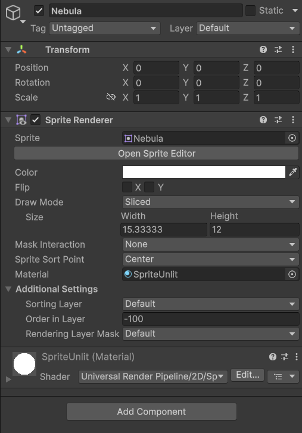 |
| `Starfield` | Background asli | Tiled | -90 | SpriteUnlit | 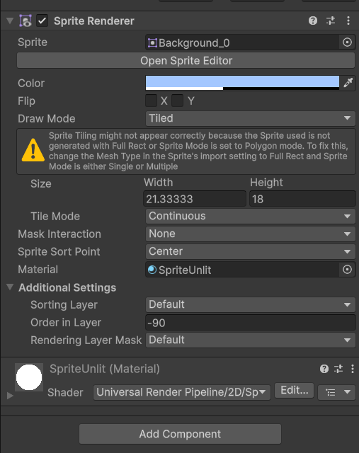 |
| `Dust` | Dust | Tiled | -80 | SpriteUnlit | 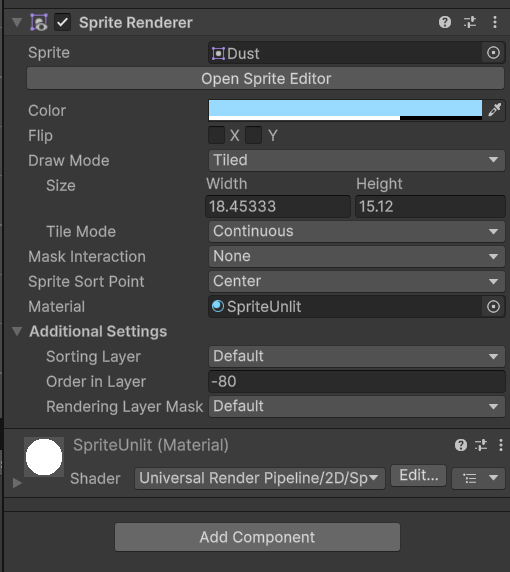 |

4. Tint Starfield sekitar RGBA `(0.64,0.78,1,0.40)`, Dust `(0.6,0.86,1,0.7)`. Background asli tidak transparan; alpha renderer membuat nebula di belakangnya tetap terlihat.

| Starfield | Dust |
|---|---|
| 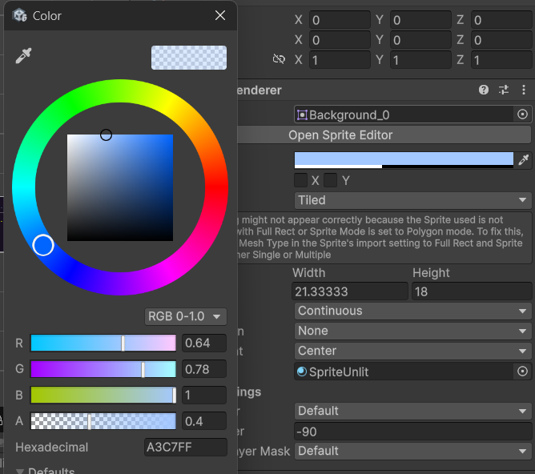 | 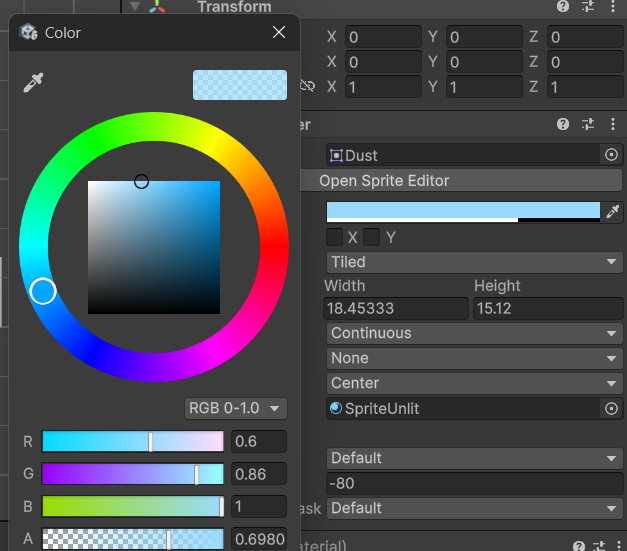 |

5. Pasang `SpaceBackdrop.cs` pada parent. Drag Main Camera ke `Target Camera`, lalu isi tiga renderer sesuai namanya.

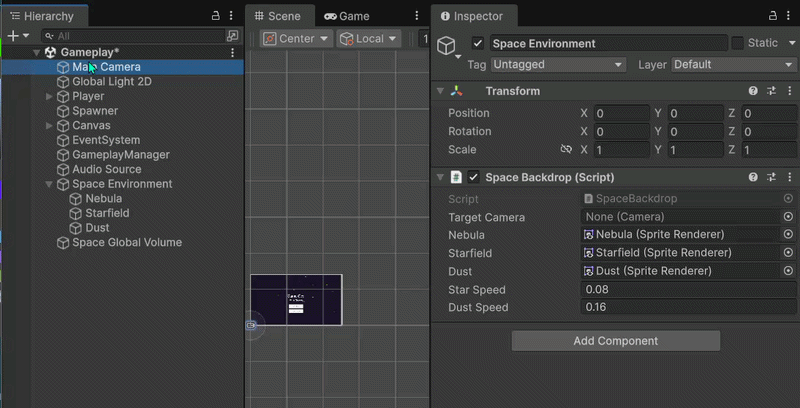

6. Atur Star Speed `0.08`, Dust Speed `0.16`. Layer depan bergerak lebih cepat untuk memberi kesan kedalaman.

`SpaceBackdrop` menghitung tinggi kamera `orthographicSize × 2` dan lebar `tinggi × aspect`. Layer ditambah margin satu tile di setiap sisi. Offset memakai `Mathf.Repeat` sepanjang satu tile, sehingga scrolling tidak berakhir di tepi sprite. Script mengatur **SpriteRenderer.size**, bukan mengubah mekanik kamera/player.

### 1.3 Atur lighting

1. Pilih `Global Light 2D` yang sudah ada. Jangan menambahkan Global Light kedua untuk layer yang sama.

2. Gunakan warna dingin RGB `(0.73,0.83,1)` dan Intensity `0.86`.

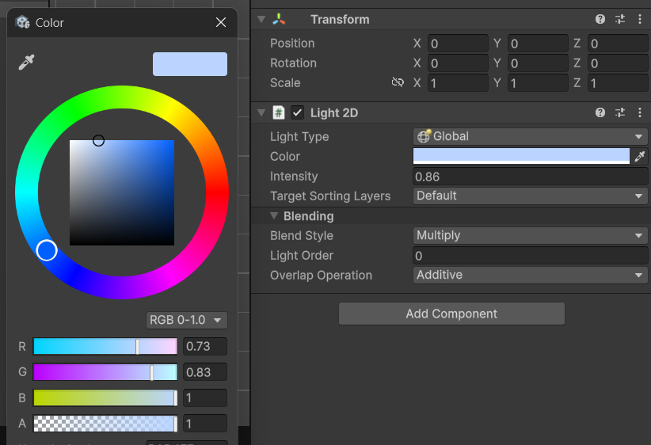

3. Buat material `SpriteLit` dengan shader `Universal Render Pipeline/2D/Sprite-Lit-Default`.

4. Material ini nanti dipakai pada visual player, star, dan meteor. Sprite Lit menerima Global Light serta Point Light 2D lokal.

### 1.4 Tambahkan volume khusus scene

1. Buat GameObject `Space Global Volume` dan tambahkan komponen `Volume`.

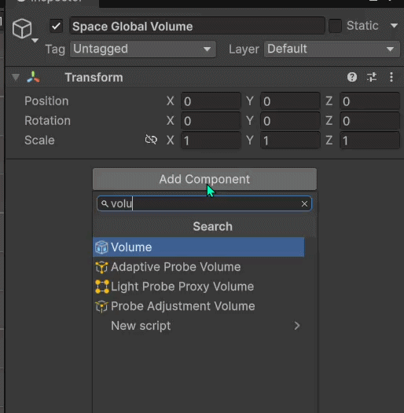

2. Pastikan modenya **Global**. Buat profile `GameplayVolume.asset` di `Assets/GraphicsPolish`. Jangan menimpa DefaultVolumeProfile bersama.

3. Add Override → Post-processing → tambahkan Bloom, Color Adjustments, Vignette. Aktifkan checkbox override pada properti yang diubah.

| Bloom | Color Adjustments | Vignette |
|---|---|---:|
| 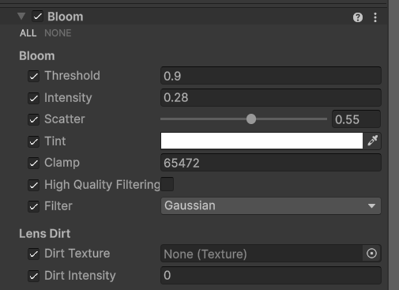 | 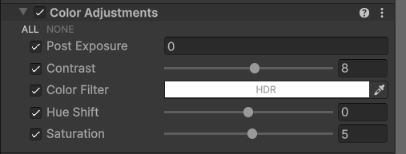 | 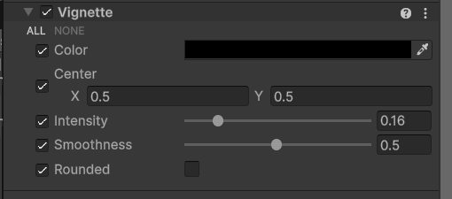 |

4. Pilih Main Camera → Rendering → aktifkan **Post Processing**, Anti-aliasing **FXAA**. HDR pipeline pada baseline sudah aktif.

5. HUD tetap pada Canvas **Screen Space - Overlay**, sehingga post-processing kamera tidak menggelapkan score.

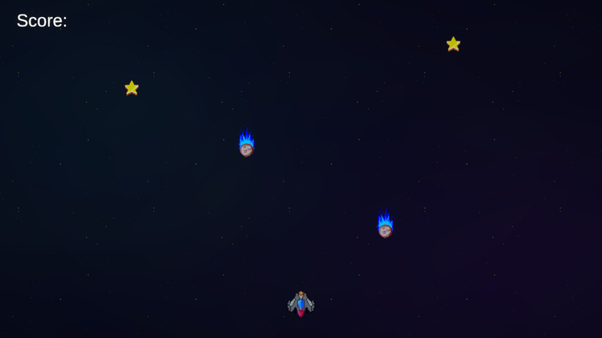
*Tahap 1: background dan rendering sudah berubah, UI dan prefab masih baseline.*

Bandingkan dengan [screenshot Gameplay sebelum polishing](resources/02-before-gameplay.png). Posisi empat object dibuat sama agar perubahan background mudah dinilai.


## Tahap 2 Feedback star, meteor, dan player

### Teori singkat: feedback, lifetime, dan waktu

**Feedback visual** menjawab pertanyaan pemain, “Apa yang baru saja terjadi?” Trail membantu mengenali object bergerak, burst menandai collision, floating score menjelaskan reward, dan flash/shake menandai bahaya. Menangkap star cukup terasa positif; meteor boleh lebih kuat, tetapi jangan menutupi informasi penting terlalu lama.

**Particle System** memancarkan banyak gambar kecil. *Emission* mengatur kapan/jumlah partikel, *lifetime* menentukan lama hidupnya, *shape* mengatur asal/arah awal, dan *renderer/material* menentukan tampilannya. Burst cocok untuk kejadian sesaat; emission per detik cocok untuk engine. **World simulation** membuat partikel yang sudah keluar tertinggal di dunia ketika sumbernya bergerak.

**Hierarchy menentukan lifetime.** Menghancurkan parent turut menghancurkan child. Karena FallingObject langsung dihancurkan saat collision, burst dibuat sebagai instance terpisah. Sebaliknya, pulse/rotasi/banking ditempatkan pada child Visual supaya Collider/Rigidbody2D di root tetap sama. Dengan begitu, tampilan tidak mengubah aturan permainan.

`Time.deltaTime` mengikuti `Time.timeScale`; ketika timeScale nol, gerak gameplay berhenti. `Time.unscaledDeltaTime` tetap berjalan. Gunakan waktu normal untuk movement/parallax, dan waktu unscaled untuk menyelesaikan explosion, flash, shake, floating score, serta cleanup setelah game over. Jika cleanup memakai waktu normal, efek bisa tertinggal selama pause.

### 2.1 Pisahkan visual dari physics

1. Buka prefab `Star_0` melalui Prefab Mode.
2. Buat child `Visual` pada local position `(0,0,0)`, rotation nol, scale satu.
3. Tambahkan SpriteRenderer pada child; salin sprite, tint, dan ukuran dari renderer root. Ganti material menjadi `SpriteLit`, Order in Layer `5`.
4. Nonaktifkan SpriteRenderer root. **Biarkan FallingObject dan CircleCollider2D pada root**, tanpa mengubah scale root `1.5` atau radius collider.
5. Ulangi pada `Meteor_0`. Pada Player di scene, gunakan pola yang sama; Rigidbody2D/Collider/PlayerController tetap pada root.

Ini mencegah pulse / banking mengubah hitbox. `Visual` boleh berputar; collider tetap menjalankan aturan semula.

### 2.2 Star: pulse, glow, dan trail

1. Tambahkan `FallingPresentation` pada root prefab. Isi `Visual`, biarkan `Meteor` nonaktif.

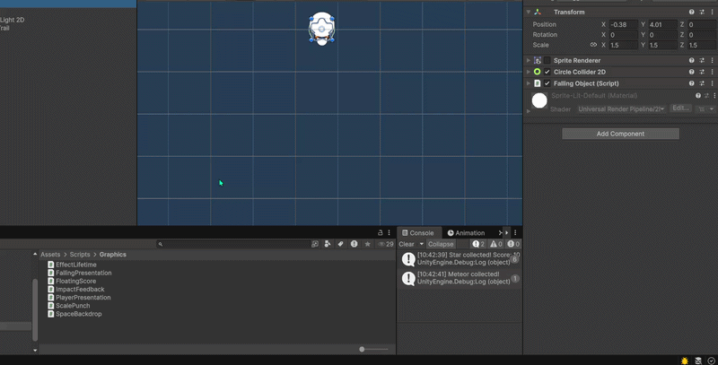

2. Script memutar visual `28°/detik`, dengan pulse ±9% pada frekuensi 5 radian/detik.

3. Tambahkan child `Glow Light 2D` pada Visual: Type Spot, Inner/Outer Spot Angle `360°` agar cahaya menyebar melingkar, warna emas `(1.0, 0.77, 0.3, 1.0)`, Intensity `1.25`, Inner Radius `0.12`, Outer Radius `0.8`. Pada Inspector versi Unity ini, cahaya point 2D diberi label **Spot**.

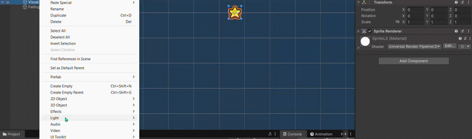

4. Tambahkan child `Falling Trail` dengan TrailRenderer. Time `0.22`, Start Width `0.085`, End Width `0`, Min Vertex Distance `0.04`, Order `2`. Warna emas menuju transparan.

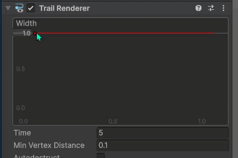

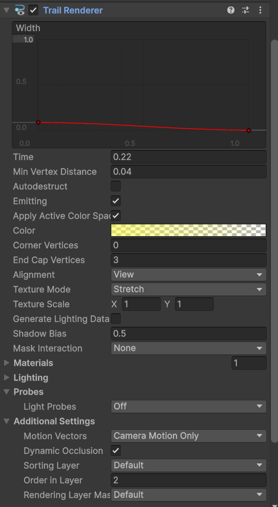

5. Gunakan material `ParticleUnlit`, shader `Universal Render Pipeline/Particles/Unlit`, Surface Type Transparent, alpha blending, texture `Spark`. Material dipakai bersama agar tidak dibuat ulang setiap frame.

### 2.3 Buat prefab burst terpisah

1. Buat Particle System `StarBurst` di scene sementara.
2. Matikan Looping, Duration `0.15`, Start Lifetime random `0.35–0.8`, Start Speed `0.88–2.2`, Start Size `0.045–0.09`, Start Color emas HDR, Max Particles `48`.
3. Simulation Space **World**, Play On Awake aktif, **Use Unscaled Time aktif**.
4. Emission: Rate over Time `0`, satu Burst pada waktu `0` sebanyak `22` partikel.
5. Shape Circle, Radius `0.12`. Color over Lifetime: putih alpha 1 menuju 0. Size over Lifetime: 1 menuju 0.

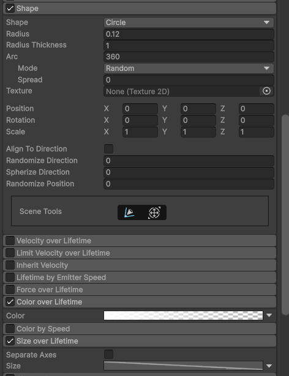

6. Renderer material `ParticleUnlit`, Order `20`.

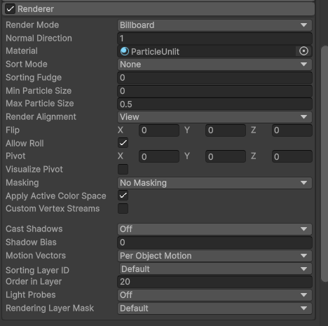

7. Tambahkan `EffectLifetime`, Duration `1.2`, lalu simpan sebagai `Assets/GraphicsPolish/Prefabs/StarBurst.prefab`. Hapus instance sementara dari scene.

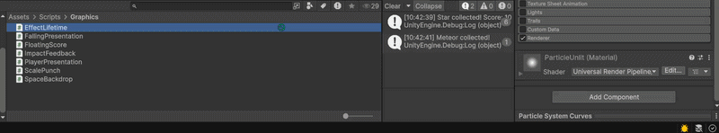

8. Isi `Impact Prefab` pada `FallingPresentation` dengan prefab tersebut.

### 2.4 Floating score dan punch

1. Buat **3D TextMeshPro** (bukan UI Text) bernama `FloatingScore`. Gunakan font TMP project, font size `4`, warna emas, alignment Center, kotak `3 × 1`, MeshRenderer Order `30`.
2. Pasang `FloatingScore.cs`, drag komponen TextMeshPro pada object tersebut ke field `Label`, lalu simpan sebagai `Assets/GraphicsPolish/Prefabs/FloatingScore.prefab`. Hapus instance sementara dari scene.
3. Isi `Floating Score Prefab` pada star. Teks memakai nilai `scoreValue` yang benar, bukan string `+10` permanen.
4. Pasang `ScalePunch` pada `ScoreText`. Durasi punch `0.28` detik, amplitudo 16%; scale kembali tepat ke nilai awal.
5. Tambahkan hook ini setelah `UpdateScoreText()` pada `ScoreManager.AddScore`:

```csharp
if (scoreText.TryGetComponent<ScalePunch>(out var punch)) punch.Play();
```

6. Pada `FallingObject.OnTriggerEnter2D`, setelah memeriksa tag Player dan **sebelum** `Destroy(gameObject)`, panggil:

```csharp
if (TryGetComponent<FallingPresentation>(out var presentation))
    presentation.PlayImpact(scoreValue);
```

7. Di cabang star, panggil `PlayerPresentation.Catch()` jika komponen tersedia pada player. Logic `AddScore`, audio, GameOver, dan Destroy tetap pada tempatnya.

```csharp
// Tambahkan di dalam cabang if (type == ObjectType.Star).
if (other.TryGetComponent<PlayerPresentation>(out var playerPresentation))
    playerPresentation.Catch();
```

`Instantiate(impactPrefab, position, rotation)` tidak menerima parent. Burst menjadi object terpisah, sehingga Destroy star/meteor tidak menghancurkan burst. `EffectLifetime` membersihkannya dengan unscaled time; floating score bergerak naik lalu fade selama 0.9 detik.

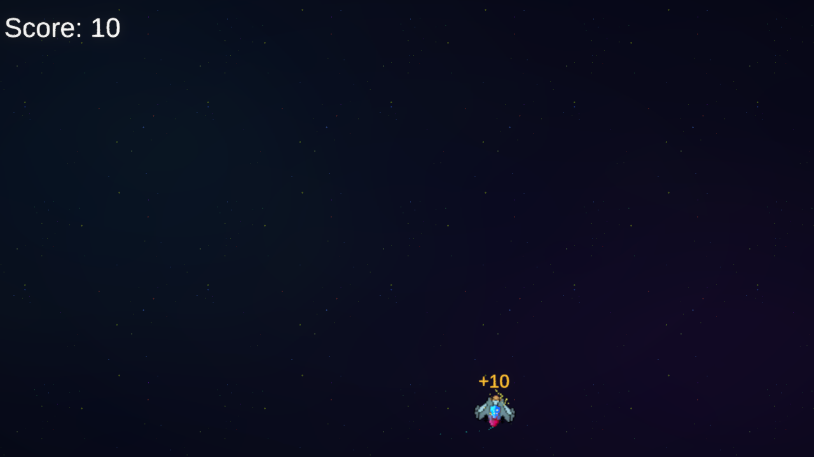
*Trigger sungguhan: star hilang, score bertambah 10, sementara burst dan floating score masih hidup.*

### 2.5 Meteor: trail, spark, explosion

1. Pada `FallingPresentation` meteor, aktifkan `Meteor`. Rotasi visual `-105°/detik`.
2. Light 2D Type Spot dengan Inner/Outer Spot Angle `360°`: warna oranye `(1,0.35,0.12)`, Intensity `1.5`, Inner Radius `0.12`, Outer Radius `1.05`.
3. Trail: Time `0.32`, Start Width `0.18`, End Width `0`, merah-oranye menuju transparan.
4. Child `Fire Sparks`: Particle System looping, Rate `18`, lifetime `0.18–0.4`, speed `0.6`, max particles `24`, ukuran `0.04–0.1`, world simulation, warna oranye HDR. Gunakan fade/size over lifetime seperti burst.
5. Buat `MeteorBurst` mengikuti StarBurst: jumlah `36`, speed `1.32–3.3`, size `0.095–0.19`, warna oranye HDR. Tetap gunakan unscaled time dan `EffectLifetime`.
6. Isi Impact Prefab dengan `MeteorBurst`; Floating Score Prefab kosong.
7. Pada Canvas gameplay, buat Image `Impact Flash`, stretch penuh, tanpa sprite, warna clear, **Raycast Target nonaktif**, paling akhir dalam hierarchy.
8. Pasang `ImpactFeedback` pada Main Camera; isi Flash. Duration `0.28`, Shake Distance `0.055` world unit.

9. Panel Game Over bawaan menutup seluruh viewport. Agar explosion terlihat, tambahkan field `gameOverPresentationDelay` pada `GameManager`, default `0`, lalu atur **0.22** pada scene Gameplay. Saat GameOver, score final dan `Time.timeScale = 0` tetap dijalankan langsung; hanya `gameOverPanel.SetActive(true)` yang menunggu `WaitForSecondsRealtime(gameOverPresentationDelay)`. Implementasi lengkap tersedia pada source `GameManager.cs`. Tampilan dan event tombol tetap seperti baseline; ini jeda presentasi benturan, bukan animasi UI baru.

Shake menggunakan pola sinus kecil, bukan `UnityEngine.Random`, agar feedback tidak mengonsumsi random sequence yang dipakai Spawner. Posisi kamera dipulihkan setelah efek selesai.

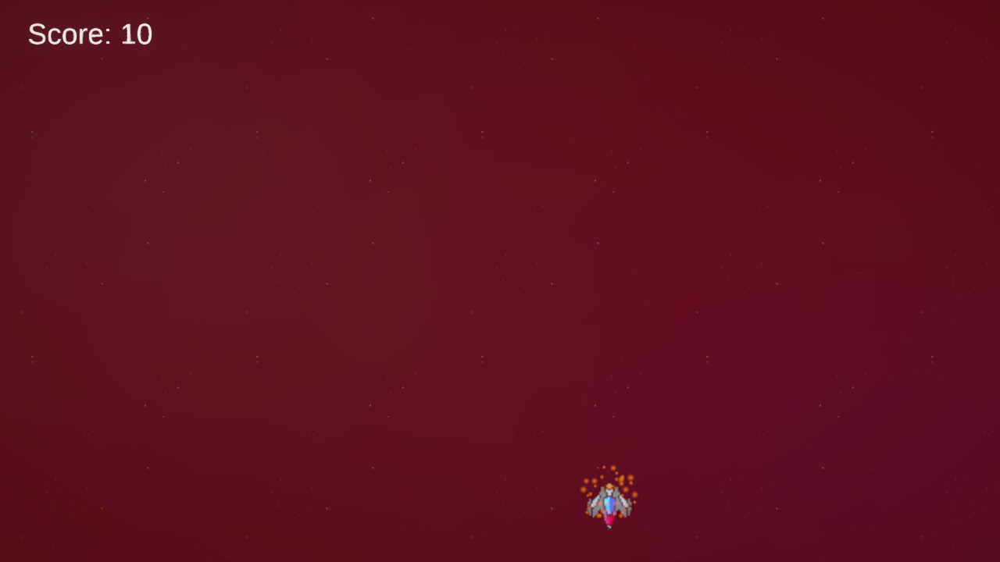
*Explosion dan flash berjalan ketika GameManager sudah mengatur timeScale menjadi nol.*

### 2.6 Player: banking dan engine

1. Tambahkan `PlayerPresentation` pada Player root, lalu isi child Visual.
2. Banking membaca selisih posisi horizontal, menghaluskan kemiringan, dan membatasi sudut ±16°. Script **tidak mengubah kecepatan atau posisi root**.
3. Tambahkan Light 2D cyan, Type Spot dengan Inner/Outer Spot Angle `360°`: Intensity `1.1`, Inner Radius `0.12`, Outer Radius `1`.
4. Tambahkan `Engine Exhaust` pada Visual, local position `(0,-0.12,0)`, rotasi X `90°`. Particle System: rate `28`, lifetime `0.18–0.4`, speed `0.6`, size `0.036–0.09`, max particles `24`, World simulation, warna cyan HDR.
5. `Catch()` memberikan squash visual kecil selama 0.25 detik.


*Setup prefab setelah tahap 2. Rotasi/trail/particle bergerak terlihat pada screenshot Play Mode berikut, bukan frame statis ini.*

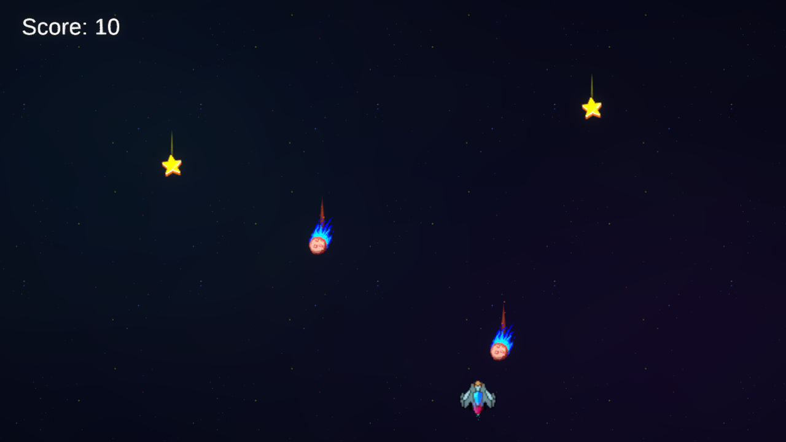


## Troubleshooting

| Gejala | Periksa |
|---|---|
| Background hilang | Sorting order negatif, renderer aktif, kamera terisi pada SpaceBackdrop |
| Tiled background menyisakan celah | Mesh Type Full Rect, Draw Mode Tiled, reference layer di SpaceBackdrop |
| Sprite terlalu gelap | Material Sprite Lit dan Global Light 2D aktif untuk sorting layer yang sesuai |
| Bloom tidak terlihat | Kamera Post Processing, HDR, override checkbox, serta material/warna efek HDR |
| Burst hilang seketika | Instantiate tanpa parent source; jangan menaruh burst collision hanya sebagai child |
| Explosion/flash berhenti saat game over | Gunakan unscaledDeltaTime atau Particle System Use Unscaled Time |
| Klik tidak sampai ke tombol | Impact Flash Raycast Target harus nonaktif |
| Player hitbox berubah | Visual child yang dianimasikan, bukan root Rigidbody2D/Collider |
| Efek pink | Shader material harus cocok dengan URP dan tersedia pada build |
| Perubahan scene tidak terlihat | Keluar dari Play Mode; buka ulang scene tersimpan setelah memastikan perubahan lokal sudah disimpan |

## File dan bahan pendamping

- [Folder assets](assets/): Nebula, Dust, dan Spark siap diimpor, termasuk file `.meta` pengaturan Unity.
- Hasil Akhir yang Sudah Jadi: [Final Result Package](source/SkyCatcher-Polishing.unitypackage)
- Script belajar: [SpaceBackdrop](source/Scripts/SpaceBackdrop.cs), [FallingPresentation](source/Scripts/FallingPresentation.cs), [PlayerPresentation](source/Scripts/PlayerPresentation.cs), [ImpactFeedback](source/Scripts/ImpactFeedback.cs), [FloatingScore](source/Scripts/FloatingScore.cs), [ScalePunch](source/Scripts/ScalePunch.cs), dan [EffectLifetime](source/Scripts/EffectLifetime.cs).
- Script gameplay dengan hook kecil: [FallingObject](source/Scripts/FallingObject.cs), [ScoreManager](source/Scripts/ScoreManager.cs), [GameManager](source/Scripts/GameManager.cs).
- Implementasi aktif berada di project `ProjectClubdev/Assets`: scene Gameplay, dua prefab lama, tiga hook script (`FallingObject`, `ScoreManager`, `GameManager`), dan asset/script GraphicsPolish.

### Menggunakan paket hasil akhir

Project utama sudah dipasangi hasil implementasi, sehingga tidak perlu mengimpor paket lagi. Untuk latihan pada salinan baseline ProjectClubdev yang sama:

1. Simpan pekerjaan dan buat salinan project. Paket menyertakan pengganti scene Gameplay, prefab Star/Meteor, dan tiga script gameplay; jangan mengimpornya di atas perubahan lain yang belum diamankan.
2. Pilih `Assets > Import Package > Custom Package`, lalu pilih paket di atas dan periksa daftar asset sebelum Import.
3. Paket sengaja tidak menyertakan Project Settings, Packages, MainMenu, atau duplikat sprite/audio/font baseline. Gunakan pada baseline ProjectClubdev yang memiliki GUID asset sama. Jika membangun project sendiri dari nol, ikuti wiring manual modul dan isi referensi Inspector sesuai asset milikmu.
4. Tunggu kompilasi, lalu buka scene Gameplay untuk melanjutkan praktik.
